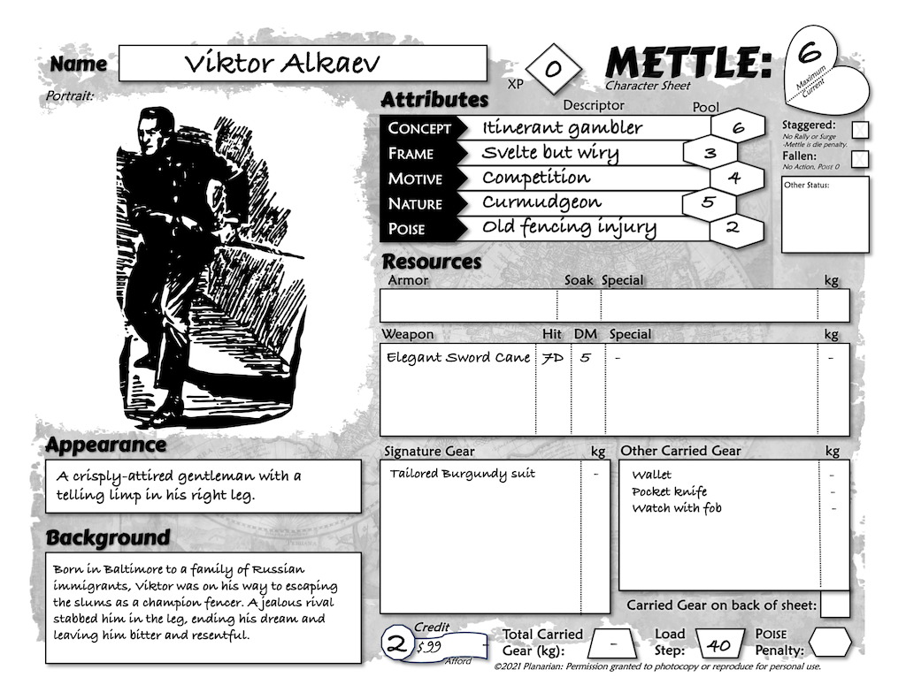

*Players and Guides both need **Characters**, and here is where your journey begins. The Character is your alter ego during a game, akin to how an actor embodies an improv role. You have the freedom to base them on yourself, favorite fictional figures, or entirely original ideas. METTLE Core defaults to a roughly modern setting and this influences the options found below. Character sheets are available online or at the end of this book.*

## Table of Contents

{: .no_toc}
- TOC
{:toc}

## Step 1: Name

This can be a tough choice unless you have a Dickensian knack for clever names. A solid idea is to go with something audacious and easy to pronounce. This also helps others at your table remember it. If you get stuck, come back to it later. There is space at the end for pronouns to reflect sex and/or gender.

**Examples:** *Sathington Willoughby, Kreeton, Jeremiah Harper Esquire, Dr. Asphodel (she/her), Puddin' Tame, etc.*

## Step 2: Appearance

What others see when they meet the character. These are *Adventurers* so make them stand out! Look to this section later when you need to introduce them to others in-game. Appearances are freeform but try to include their apparent age, gender, and an unusual trait to help them stand out. When playing someone with different features than yourself, do so with care and respect.

**Examples:** *a clean-cut androgynous youth with a long red nose; a filthy man in a trench coat with a shuffling gait; a woman of a certain age showing only a crooked smile under the outsized brim of a floral hat.*

<strong>APPEARANCE SEEDS</strong>

Invent, choose, or roll on the table below to snap you out of any pesky
creative paralysis.
These distinctive features give you just enough to work with. Be creative and make them sing on your character sheet!
To use a d66 table, roll one six-sided die and then another. For example,
if you roll a 6 and a 2, go to the distinctive feature in the row for "6, 2."

{: .lh-0}
| d66 | Distinctive Feature |
|:----------:|:------------------------------------------------------|
| 1,1 | Bestial (leonine, mousy, bird-like...) |
| 1,2 | Birthmark (animal-shaped, patchy...) |
| 1,3 | Cheeks (sunken, ruddy, puffed...) |
| 1,4 | Chin (cleft, pointy, broad...) |
| 1,5 | Complexion (freckles, acne, smooth, ruddy ...) |
| 1,6 | Ears (pointed, cauliflower, huge...) |
| 2,1 | Eye color (vivid blue, dichromatic, tiger...) |
| 2,2 | Eye shape (close-set, piercing, wide...) |
| 2,3 | Eyebrows (patchy, fierce, bushy, none...) |
| 2,4 | Face (wide, narrow, oval, heart-shaped...) |
| 2,5 | Facial hair (mustache, goatee, lip fuzz...) |
| 2,6 | Filthy (bad breath, unwashed, greasy...) |
| 3,1 | Forehead (sweaty, broad, furrowed...) |
| 3,2 | Gaudy (polka dots, pastels, paisley....) |
| 3,3 | Growth (horn, hump, tumor...) |
| 3,4 | Habit (superstition, nervous tic...) |
| 3,5 | Hair color (blue, white, red...) |
| 3,6 | Hair style (pompadour, bald, frizzy...) |
| 4,1 | Hands (extra finger, webbed, huge...) |
| 4,2 | Laugh (snorts, honks, comforting...) |
| 4,3 | Makeup (luxurious, clownish, fierce...) |
| 4,4 | Mole (beauty mark, distracting...) |
| 4,5 | Motto (exclamation, meme, curse...) |
| 4,6 | Mouth (wide, full, luscious, pursed...) |
| 5,1 | Neck (long, crooked, stubby...) |
| 5,2 | Noise (creaky, silent, belching...) |
| 5,3 | Nose (aquiline, flat, long, red...) |
| 5,4 | Odor (floral, body, ozone, garbage...) |
| 5,5 | Piercing (eyebrow, nose, tongue...) |
| 5,6 | Scar (facial burns, old wounds...) |
| 6,1 | Style (Sporty, punk, business, Boho...) |
| 6,2 | Tattoo (artistic, tribal, prison...) |
| 6,3 | Teeth (missing, gap, filed to a point...) |
| 6,4 | Trinket (lucky hat, jewelry, stuffed animal...) |
| 6,5 | Unkempt (poorly fit clothes, messy hair...) |
| 6,6 | Voice (gruff, flat, high-pitched...) |

## Step 3: Attributes

These are your character's ***CONCEPT,*** ***FRAME, MOTIVE, NATURE,*** and ***POISE*** pools.  Attributes lend them substance within the rules of the game. The more dice there are in an Attribute ***Pool***, the better they are at things related to it. Attributes range from 1 to 6 for starting characters, with a 3 being average. Experienced adventurers may exceed those bounds at the Guide's discretion.

Each Attribute may also bear a ***Descriptor***; a word or phrase fleshing out what the Attribute covers. This defined scope is vital for the ***CONCEPT*** Attribute and useful for the others. Having the right Descriptor for a task may even let you just assume success. Players may leave Descriptors blank at creation and discover them as they play.

Starting characters are well above average, with room to grow. You can make more or less "heroic" characters by changing the number of points they start with. Choose a starting ***array*** or buy Attributes ***freestyle***. Both methods are equivalent.

**Array method:** this gives a set starting array of **[6, 5, 4, 3, 2]**. Put each of the array numbers into each Attribute in any order.

**Freestyle method:** take **26** points to spend between Attributes, as in the table below. The highest costs double, and one cannot put more than half of their points in a single Attribute.

<strong>ATTRIBUTE POOLS</strong>

{: .lh-0}
| Pool | Rating | Concept Cost | Other Cost |
|:-----------:|:---------------|:--------------:|:------------:|
| 1D | Poor | 2 | 1 |
| 2D | Low | 4 | 2 |
| 3D | Average | 6 | 3 |
| 4D | High | 8 | 4 |
| 5D | Great | 10 | 5 |
| 6D | Amazing | 12 | 6 |

Attribute pools can improve later with experience points. Gain these by recounting memorable events from the last adventure.

Circumstances or equipment may change an Attribute pool. In this case, put the modified pool in parentheses to the right. For example, "POISE 4(5)". Use the original *unaltered* pool for calculating Experience, Backstories, and Mettle.

Unusual settings may introduce entirely new Attributes for things like cybernetics, magic, superpowers, and martial arts.

### CONCEPT

This is the Adventurer’s calling in life, and the size of their dice pool tells you how good they are at it. CONCEPT is special because it can replace other Attributes if higher and better suited for the task. For example, a *Royal Fencing Instructor* could use their CONCEPT instead of NATURE when wielding a fencing blade. This is only for the active side of a Check; CONCEPT cannot swap in for other Attributes used as a passive Difficulty/defense. Any Bonuses or Penalties to the original Attribute pool also apply to the CONCEPT pool.

Guides often grant free information or automatic success with the right CONCEPT Descriptor. For example, a *Professor of Ancient History* or *Greek Citizen* would know plenty about the Parthenon, while those with less relevant Descriptors are stuck with making Checks.

**<u>Example Descriptors</u>:** *cat burglar, astromech pilot, village
blacksmith, unemployed librarian, time-traveling lunatic, courtier,
etc.*

### FRAME

Adventurers come in all shapes and sizes. The pool reflects the physical power of the character: their might, vigor, and vitality. As such, FRAME helps bear burdens as well as dish out and take damage in combat. The Descriptor should include their body type or build and even their species if non-human.

FRAME is an unusual Attribute because it is not subject to Checks and scales with size, especially for large animals or monsters. In these cases, note the modified value in parentheses as usual.

**<u>Example Descriptors:</u>** *medium, tall and lanky, short, chunky,
average build, athletic, pot-bellied, lanky, plump, stout, sprightly,
etc.*

### MOTIVE

An interesting character is fueled by an overarching goal that drives their actions and keeps them going even when things seem hopeless. Those with a high MOTIVE are alert and focused. This forms the pool for most untrained mental Checks, keeps them up at negative Mettle, and defends against the wiles of stealthy or manipulative foes. A strong motive may be unhealthy for a normal person, but adventurers often harbor overwhelming drives and passions. If the MOTIVE is ever fulfilled, they may retire or take on a new mission in life.

**<u>Example Descriptors</u>:** *Avenge my master, bring justice to the
oppressed, consume great quantities, escape from the oubliette, kill
vampires, etc.*

### NATURE

This pool embodies sheer force of personality. Most Social and Combat Checks default to this pool, both mere expressions of the fire that burns within their heart. Characters are more complex than this, so view the Descriptor for NATURE as only the tip of their personal iceberg.

A high pool can drastically alter the effect of this Descriptor! The masked vigilante and the cranky teenager may both be *Sullen*, but only one of them makes it look good.

**<u>Example Descriptors:</u>** *Sullen, earnest, mellow, intense,
friendly, feisty, high self-esteem, manipulative, affable, strange,
pensive, etc.*

### POISE

An adventurer’s bearing is often the first thing to catch the eye. For an enemy, it may be the last! Check this for coordinated Actions like dancing, dodging, climbing, swimming, and sneaking. In combat, everyone is avoiding attacks as best they can, so this forms the “passive” Difficulty for others to strike them. The Descriptor should reveal how they strut upon the world’s stage.

**<u>Example Descriptors:</u>** *Smooth & graceful, lightning reflexes,
clumsy, walks with a limp, stiff-legged gait, fast-paced, takes it
slow.*

<strong>DESCRIPTOR SEEDS</strong>

Thinking up good Descriptors for Attributes can be challenging. Use the table below if you need inspiration or just want to let Chance decide. Reword and expand to fit your idea of the character, if needed.

{: .lh-0}
| d66 | CONCEPT | MOTIVE | NATURE | POISE | FRAME |
|:----------:|:---------------------:|:--------------:|:----------------:|:-----------------:|:---------------:|
| 1,1 | Acrobat | Achieve | Aloof | Brutish | Athletic |
| 1,2 | Artist | Afflict | Blunt | Casual | Burly |
| 1,3 | Assassin | Atone | Cheerful | Creaky | Burly |
| 1,4 | Athlete | Avenge | Cryptic | Drowsy | Chunky |
| 1,5 | Boxer | Conceal | Curious | Feral | Curvy |
| 1,6 | Burglar | Conquer | Daring | Fidgety | Gaunt |
| 2,1 | Butler | Control | Eager | Formal | Giant |
| 2,2 | Celebrity | Create | Elegant | Frantic | Healthy |
| 2,3 | Clown | Desire | Erratic | Gentle | Husky |
| 2,4 | Cowboy | Destroy | Fearful | Graceful | Imposing |
| 2,5 | Criminal | Devote | Friendly | Hasty | Lanky |
| 2,6 | Detective | Endure | Gloomy | Jerky | Leggy |
| 3,1 | Dilettante | Enforce | Intense | Jittery | Medium |
| 3,2 | Doctor | Enjoy | Kindly | Leaning | Petite |
| 3,3 | Drifter | Enrich | Loyal | Lively | Plump |
| 3,4 | Driver | Escape | Mellow | Looming | Portly |
| 3,5 | Engineer | Explore | Mirthful | Loose | Robust |
| 3,6 | Explorer | Honor | Perky | Perky | Rugged |
| 4,1 | Fencer | Imitate | Polite | Quivering | Shapely |
| 4,2 | Gambler | Impress | Proud | Regal | Short |
| 4,3 | Hacker | Learn | Quaint | Relaxed | Slender |
| 4,4 | Laborer | Obtain | Quiet | Shaky | Slight |
| 4,5 | Martial artist | Outwit | Reckless | Shifting | Squat |
| 4,6 | Mercenary | Praise | Saucy | Shuffling | Stocky |
| 5,1 | Occultist | Promise | Serious | Slinky | Stout |
| 5,2 | Pilot | Protect | Shifty | Slouching | Stubby |
| 5,3 | Royalty | Pursue | Shy | Sluggish | Stunted |
| 5,4 | Sailor | Recruit | Sincere | Smooth | Svelte |
| 5,5 | Scholar | Redeem | Sinister | Steady | Tall |
| 5,6 | Scientist | Rescue | Stoic | Stiff | Thick |
| 6,1 | Socialite | Reveal | Stubborn | Stilted | Thickset |
| 6,2 | Soldier | Revive | Suave | Swaggering | Thin |
| 6,3 | Spy | Serve | Uncouth | Tense | Trim |
| 6,4 | Student | Steal | Uplifting | Tranquil | Waifish |
| 6,5 | Vagrant | Survive | Weird | Waddling | Wide |
| 6,6 | Vigilante | Uplift | Zealous | Wiggly | Wiry |

## Step 4: Mettle

Distance from doom. This is a mixture of stamina, willpower, and morale, normally equal to the character’s CONCEPT. Damage to Mettle is considered only “flesh wounds,” exhaustion, or vulnerability until it drops to zero or lower, implying far more troubling injuries.

While above zero, Mettle refills upon starting a new Scene. Rallies can restore it even in the heat of battle by doubling current Mettle – up to the maximum of course.

{: .highlight }
>- Mettle = CONCEPT

### Taking Damage

Characters may suffer ***Damage*** from hazards or attacks they face. If their wits fail them, they must rely on their Soak to reduce incoming damage. Soak is usually equal to FRAME plus Armor. Any damage left after Soak lowers current Mettle. If Mettle falls to zero or below, the target is either **Staggered** or **Fallen**:

*Staggered*: Mettle from 0 down to negative MOTIVE. For example, if their MOTIVE is 3, they are Staggered at Mettle 0 to -3. They take a penalty to all Checks equal to their negative Mettle and can no longer Rally.

*Fallen*: Mettle dropped below their negative MOTIVE. They lose their Action and have 0 POISE for the Scene. They are likely dead unless they receive aid.

{: .highlight }
>- Damage exceeding Soak reduces Mettle temporarily.
>- Staggered: zero to -MOTIVE. No Rally, negative Mettle is penalty.
>- Fallen: below negative MOTIVE; lose Action and POISE is zero.

### Surges

Mortal peril can push a combatant beyond their usual limits of violence, at the cost of stress and vulnerability. Halve current Mettle to regain their spent Action, making them eligible for Initiative (p.36) again that round. The Surging character must have at least 2 Mettle and the new Action can only be an Attack.

{: .highlight }
>- **Surge:** Halve current Mettle to regain a spent Action for Initiative.

## Step 5: Resources

Outfitting your character is a terrific way to get to know them. What an adventurer has at hand impacts how they deal with the crazy situations they get into. Even intangibles like debts, favors, oaths, promises, burdens of guilt, memberships, rank, etc. belong here.

You need only specify important gear on the character sheet. When a character would reasonably have something else, be reasonable and assume they do. Even if they did not write it down, a scientist knows people at their lab, someone with a car has a spare tire, etc.

### Credit

Money, funding, access, or abstract "pull." The Guide assigns Credit based on the setting and circumstances. This is usually a 2 or 3 for most games. Credit can change during play as the wheel of fortune turns.

<strong>CREDIT</strong>

{: .lh-0}
| Credit | Afford | Ranking |
|:-------------:|-----------------|--------------------|
| 1 | \$9 | Needy |
| 2 | \$99 | Struggling |
| 3 | \$999 | Comfortable |
| 4 | \$9,999 | Prosperous |
| 5 | \$99,999 | Affluent |
| 6 | \$999,999 | Rich |

A character can afford items with up to as many digits in their price as their Credit. For example, with Credit of 3, one can gear up with items worth up to \$999 (1-2 digits) each. If they want to buy something one Credit digit higher, they lose a digit of Credit temporarily. Lost Credit recovers between campaigns.

List discrete windfalls, suitcases full of cash, stolen piggybanks, or other treasures as separate items. This prevents them from affecting Credit and preserves the appeal of special loot.

### Signature Gear
Pulp heroes may or may not have special, iconic, tell-tale gear like a domino mask, costume, zoot suit, signet ring, rumpled trench coat, stupid looking hat, gizmo belt, etc. To be signature gear implies that others in the setting would recognize them if they saw it, for better or worse. Some leave this blank and wait for later inspiration.

### Contacts

Choose up to as many helpful people or groups as their Credit and write them down in the Resources box. Call upon these for favors or advice. They can even step into the story to save the character in a pinch. As always, you can hold off choosing until later.

If a character abuses their Contacts, they may lose them. The only way to bring them back is to make amends or replace them. They may also fall back into good graces between campaigns, depending on how awful the character was to them.

### Languages
Starting characters read, write, and speak their native language fluently unless their players decide otherwise. They can also make Know Checks to understand closely related languages. Learning and retaining other language skills requires an investment of time, effort, and travel. As such, they are limited mainly by one’s Resources.

A starting character can be conversational in as many foreign languages as their Resource score, or fluent at the cost of two languages. These do not have to be taken at creation, in fact it is often better to wait and see what other cultures and languages the party finds itself most engaged with and learn them later between campaigns.

Losing Resources leads to a slow skill deterioration due to lack of practice. The player can decide which languages get rusty and can learn them back very quickly if their situation improves.

### Encumbrance

Most of the time, Players should be able to avoid tracking how heavy their gear is just by not going overboard with it. On the other hand, one can only carry so much, especially when lugging loads of lovely loot from a lucrative locale. How much they or their vehicles can handle depends on their FRAME.

FRAME determines the Load Step: how much weight they can carry without trouble. Every time they exceed this, they take a penalty to POISE-linked Actions like Move and Travel. As usual, if a more fitting CONCEPT replaces POISE, the penalty applies to it instead. If the penalty drops their pool to zero dice, they are Incapacitated. Vehicles are affected the same way, as Handling Checks depend on POISE.
For example, an average guy with a FRAME of 3 (Load Step 18) hauling a 20 kg monkey idol out of a museum takes a -1D penalty. Their athletic buddy with a FRAME of 4 (Load Step 25) would be just able to shoulder it with less trouble.
The table below gives the Load step and Shift (max lifted off ground, dragged or pulled) for most common FRAMES.  Load steps are given in kilograms (kg), due to the international nature of pulp adventure.

<strong>ENCUMBRANCE</strong>

{: .lh-0}
| Frame | Load Step | Shift |
| --------- | ------------- | --------- |
| 1         | 20            | 145       |
| 2         | 30            | 230       |
| 3         | 40            | 300       |
| 4         | 55            | 420       |
| 5         | 75            | 575       |
| 6         | 100           | 790       |
| 7         | 140           | 1085      |
| 8         | 190           | 1500      |
| 9         | 260           | 2065      |
| 10        | 360           | 2845      |

Do not bother counting most items less than a pound or so. The character sheet assumes you will be listing items that are not weapons or armor on the back of the sheet, tally that weight in the Back Gear box in the Resources section.
Overloaded characters may drop bulky gear such as backpacks to avoid encumbrance or distract pursuers. These can be dropped freely but picking them back up costs an Action (Move).

{: .highlight }
- Carry weight up to Load step without trouble.
-	-1D to POISE-related Checks for each time weight exceeds Load step
- Incapacitated if penalty drops a Check to zero dice.

## Experience

Characters in METTLE Core set out as highly competent adventurers but there is always room for improvement. This takes the form of earning ***Experience points*** (XP) to raise their Attribute pools. To earn XP, players recount the boldest and bravest events of the last session.

### Getting XP

Hand out XP at the *beginning* of each game session after the first. Think of this as the "On the last episode of..." recap at the start of a TV show. First, the Guide chooses a player and asks something like:

**"Tell us one of your favorite moments from the last game."**

Each player then gets a turn to talk about a memorable event or ***Highlight*** from the last game, netting them an XP. It can be something they did individually, as a group, or just something wild that happened. Even failures or bad ideas count if they were memorable. If they use something another player did, that player can still use it for their own turn. Others at the table can chip in if a player asks for help.

Give them two rounds of this for a medium-length game session, and three for a long one. This means typical XP awards are from one to three XP, depending on the length of the last session.

**Examples:** *came up with a clever plan or idea, solved a mystery or puzzle, defeated a dangerous foe, good sport about a drastic failure, "went along" with a social Check, fulfilled their MOTIVE, etc.*

If a player is bringing up highlights the rest of the table finds obnoxious, consider that XP are partly diagnostic. Finding out what a player thinks is worthy tells you how they want to play. Talk it over.

Players who miss a session can still get XP from the last one they attended, and a bonus XP for describing how they rejoined the party.

### Spending XP

To raise CONCEPT by one, spend twice its current level in XP. To raise any “lesser” Attribute by one, spend XP equal to CONCEPT.  To raise any “lesser” Attribute by one, spend XP equal to the highest. If two or more of the highest are equal, the one you are raising counts as the highest.

You may spend XP during the actual game, especially during a tense conflict! This represents learning an opponent’s moves, growing from a rivalry, or lengthy training finally coming to fruition.

{: .highlight }
- Raise CONCEPT: XP cost = CONCEPT x 2
- Raise other: XP cost = CONCEPT

## Example Character

Dana is making a new character for an upcoming game. Her Guide set it in an alternate Baltimore circa 1904, centering on mysteries with subtle plot-related supernatural elements -- sort of a cross between *Gangs of New York, Bloodborne,* and *True Detective*.

**Step 1 -- Name:** Viktor seems like a catchy name and a good play on words for a character meant to be a good fighter. He needs a last name too, but she decides to skip it for now.

**Step 2 -- Appearance** Dana thinks it would be fun to play a sardonic H.R. Mencken type with a sword cane. She decides on a thin, well-dressed mature gentleman. Maybe suffering from an old leg injury? She writes *"A crisply-attired gentleman with a telling limp in his right leg."*

**Step 3** **-- Attributes:** Dana decides to go with the array to keep things simple. She rolls “Gambler” as his CONCEPT, spices it up as “Itinerant Gambler,” and gives it the mandatory 6D. She sees him as difficult to deal with, so she chooses “Competition” as his MOTIVE at 4D, and “Curmudgeon” as his NATURE at 5D, reflecting his sharp tongue and fencer’s bravado. The low 2D goes in POISE to reflect his “old fencing injury” to the leg – he is not as agile as he was. The other 3D goes in FRAME as he is “svelte but wiry.” She pauses for a second; Viktor honestly seems like a bit of a jerk, but also a lot of fun to play.

Armed with these details, she goes back to the Name step. She picks the last name "Alkaev" from a search of Russian family names.

**Step 4 -- Mettle**: is 6 because his CONCEPT is 6.

**Step 5 -- Resources:** Dana’s Guide assigns 2 (Struggling) for Credit based on Viktor’s situation. Dana isn’t sure yet what his Signature gear should be, but for now he tends to wear a finely Tailored Burgundy Suit, which is fairly distinctive. He carries an elegant sword cane, which is light enough not to be a burden, and no armor.

Less iconic items she places on the blank back of his sheet. She notes that he lives in a modest apartment well within his means, carries a pocketknife, a pocket watch & fob, and a deck of cards. None of this gear is a great burden to carry, so no worries about encumbrance.

For Contacts and Languages, he speaks Russian from cooking with his mom at home and has two contacts for now: Oleg – whom he owes money to, and Samuelson – an old fencing rival. In keeping with his personality, these are somewhat hostile relationships, but this is fine: Oleg may help Viktor just to finally get his money back, and Samuelson out of a lingering esprit du corps with the fencing world. She can work out his other Resources as needed during play.

<strong>EXAMPLE CHARACTER</strong>

