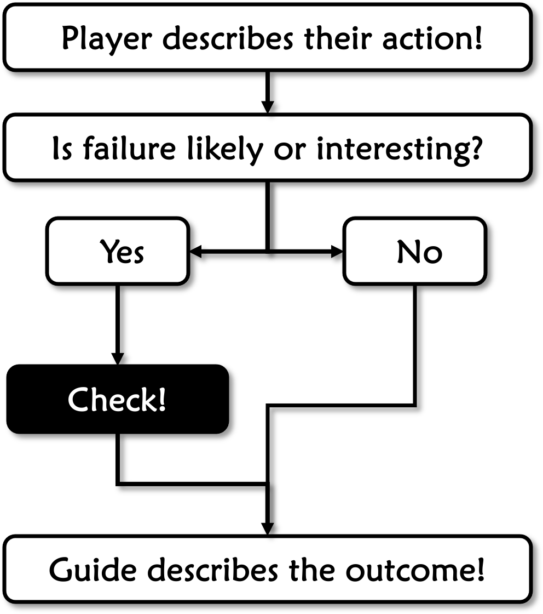

*This chapter explains how METTLE Core settles the outcome of interesting and uncertain actions. Briefly, the dice are an oracle to see what happens and inspire further drama. Roll a pool of dice based on the character's relevant ability to see how successful they were. Failure is rich in dramatic possibilities, so do not fear it.*

## Table of Contents

{: .no_toc}
- TOC
{:toc}

## Rolls

Call for a **Roll** when you need a random number and are not worried about success or failure. This is useful for encounter tables, enemy numbers, damage from hazards, falls, traps, etc. To do this, roll the dice and add up the numbers on the faces. The “d” in a Roll is always lowercase. For example, a “3d6” roll results in a number from 3-18.

While uncommon, you may see fractional rolls for narrower ranges, such as 1-2 (1d6 ÷ 3 or flip a coin) or 1-3 (1d6 ÷ 2). Sometimes you halve or double the result of a Roll. If halved, the general halving rule in this game is to round up. To keep things simple, avoid the use of fractions beyond this.

### Roll Modifiers

***Bonuses*** (+) or ***Penalties*** (-) may apply to a Roll, such as “2d6+4” giving a result from 6 to 16, or “2d6-4” for a result from 0 to +8. The result of a roll never drops below zero. As a general rule, do not stack bonuses or penalties from multiple sources, only apply the highest bonus and penalty from the situation.

1.  Roll the required dice.
2.  Add up the die face results.
3.  Apply any bonuses or penalties.

## Checks

A ***Check*** is when you are “checking” to see if an action succeeds or fails by rolling a pool of dice. These are central to working with the METTLE engine, so just learning these lets you easily handle the rest of the system. A Check may also yield unexpected benefits or drawbacks, making it a useful prompt for interesting scenes.

### Success & Failure

To make a Check, declare what your character is doing, then roll dice equal to the Attribute they are doing it with. Add up the face numbers of all the dice showing 1-3; this is the ***Score***. Count the number of dice showing 4-6; this is the ***Edge***. For example, rolling [4, 1, 3, 5, 2, 2] yields a Score of 8 (from 1 + 3 + 2 + 2) and 2 Edge (from 4 & 5). Score determines if you succeed, while Edge reflects the quality of success.

Your Check succeeds if the Score equals or exceeds (≥) the **Difficulty** of the task. This can be an arbitrary number set by the Guide or a target’s defensive Attribute. Most Checks do not count excess Score, so once you reach the Difficulty you can stop adding it up.

{: .text-center }
**READING the DICE**

<strong>DIFFICULTY</strong>

{: .lh-0}
| Difficulty | Ranking |
|:-----------------:|------------------------|
| 1 | Routine |
| 3 | Challenging |
| 6 | Daunting |
| 10 | Formidable |
| 15 | Nigh Impossible |

The more Edge you get and still succeed, the better. A higher Edge may mean they did it faster, made it harder to undo, yielded more info, improved quality, added special effects, etc. Even if you fail, having Edge lets you propose a Twist to get a second chance.

<strong>EDGE</strong>

{: .lh-0}
| Edge | Quality of Success |
|:-----------:|---------------------------|
| 0 | OK |
| 1 | Good |
| 2 | Great |
| 3 | Excellent |
| 4 | Amazing |
| 5+ | Legendary |

It is best for the Guide to assume competence and only call for a Check when the outcome is interesting or uncertain. For their part, Players should brazenly presume success and only stop for a Check if the Guide demands it.

One may often just assume success if their Pool is higher than the Difficulty. On the other hand, you might notice it is impossible to beat a Difficulty three times your pool or higher. Try something else!

{: .highlight }
>-	Roll a number of dice equal to the Attribute being used.
>-	Add up dice showing 1–3 for the Score.
>-	Count the number of dice showing 4–6 for the Edge.
>-	Check succeeds if the Score is at or above Difficulty.
>-	Edge is the quality of success or potential for a Twist on failure.

{: .note }
blanking out the 4-6 faces with crayon, tape, marker, paint, etc. can make Checks much easier!

{: .note }
The average Score of a single die is 1, making it easy to
gauge chances of success. This also means you can directly contest
single Attributes, using one as the active Check and the other as its
passive Difficulty.

### Check Modifiers

A Character may have Bonuses or penalties (+D or -D) to their pools. For example, +2D means add two dice and -2D means subtract two. Bonuses stem from advantages like equipment or good ideas, while penalties come from disadvantages like injury or encumbrance. Do not stack modifiers, only count the largest bonus and/or penalty.

Modifiers can also apply to the Difficulty of a Check. Raising or lowering Difficulty (+/- Difficulty) usually reflects the situation instead of the character. For example, rain-slicked streets may raise the Difficulty of a foot chase, and a shield adds to POISE Difficulty versus attacks.

{: .highlight }
>- Bonuses and penalties add or subtract dice from Checks.
>- Difficulty or Defense Modifiers change Difficulty of the task.

### Twists

These give a chance to turn a failure into a messy success. If you fail a Check but have Edge, you may call upon the table for a Twist. After the Guide or another Player proposes a suitable Twist, re-roll all Edge dice. Tally up the new Score and Edge. For example, a player Checks 5 dice against a Difficulty of 3. They come up [1, 4, 4, 5, 6]: Failure! They call for a Twist, keeping their Score of 1 and re-rolling the four Edge dice. They get [1, 3, 5, 5] and combine it with their old Score of 1 for [1, 1, 3, 5, 5]. The result is a Score of 5 and an Edge of 2 – success!

 The default Twist is ***Delay,*** meaning you lose your next Action dealing with a complication from the current one. For example, a weapon gets stuck, travelers get lost, a gun jams, a runner stumbles, shaken by the horrors of war, etc. Delay is the default because the effect is simple, aversive, and explanations are easy to come up with.

Other types of Twists are ideally *immediate setbacks* that apply *regardless of success or failure* and *derive from the fiction*. For example, losing a weapon, breaking gear, harming a relationship, inflicting collateral damage, blurting out something incriminating, etc. These should be directly connected to the action triggering the twist – not unrelated coincidences, however unfortunate.

The Guide and *other* Players come up with the creative Twist, not the Player making the Check. If the acting Player (or the Guide!) does not like it, they can always fall back to Delay. This is a safety valve to settle the matter so play can continue. The Player can also just call off the Twist entirely and accept failure as the gift it is.

{: .highlight }
>- On a failure, you may call for a Twist if you have Edge.
>- Ask the table for a suitable complication then reroll Edge dice.
>- Use the new, partially rerolled result but suffer the Twist.

<strong>TWIST SEEDS</strong>

{: .lh-0}
|**Type**|**Example Consequences**|
|---|---|
|Confuse|Lose *trust*: mistaken identity, mistranslation, half-truth...|
|Delay\*|Lose *next Action*: stuck, stalled, distracted, shaken...|
|Dismay|Lose *morale*: lost contact, harm relations with others...|
|Expose|Lose *secret*: cover blown, reveal a secret, leave clues...|
|Imperil|Lose *safety*: friendly fire, obstacle, unwanted attention...|
|Waste|Lose *resources*, use up credit, lose or break items...|

## Procedure
The prior pages offer a superb explanation of how to do things that call for Checks. This page makes it clear just when to use them. The best advice is to use them rarely; only when a random outcome is interesting. Using the dice too much makes them feel less special and slows down the pacing of a Scene.

On the other hand, it is perfectly fine to run an entire game without resorting to a Check! Players should strive shamelessly to get away with narrating as much as they can without even hinting at the need for one. Play it cool. Leave it to the Guide, or other Players to rat you out for a Check when the action seems dubious.

Consider zooming a Check in or out depending on how much focus you want on a Scene. Zooming in calls for more Checks on complex tasks and zooming out can resolve a whole Scene in one swoop. This aids with pacing and is a hallmark of advanced tables.

<strong>PROCEDURE</strong>

## Example of Play

This gives you some insight into how to play this game, at least for the parts where you want to use the rules. Your experience may vary because any RPG depends heavily on the group involved. Play with good people and you will have a good game.

The Guide has gotten together with a few good friends as players: *Dana* and *Troy*. Dana is playing Viktor, the embittered ex-fencer from the character creation example. Troy is playing Kirin, a cunning and stealthy type.

**Guide:** Ok, so last session you two were trying to sneak into the upper floor of a suspicious antique store. It's midday and you are still in the shop posing as customers, where we left off. There are no other customers now and the clerk is at his desk fiddling with the register. He doesn't seem to be watching you. How are you going about this?

**Troy/Kirin:** Is there a door in the shop leading to the upper floor?

**Guide:** yes, there is -- but in the back of the shop in full view of the clerk.

**Troy/Kirin:** hmm, I need cover to sneak in there. Any other way...?

**Dana/Viktor:** Well, I'm not much for sneaking around but I can distract the clerk. I look for an item and pretend I am interested. What's in here anyway?

**Guide:** Oh, uh... usual antique store stuff. A set of crystal glasses, a record player, a samovar, an old cash register...

**Dana:** what's a samovar?

**Guide:** kind of a fancy Russian tea kettle.

**Dana:** Oh, Viktor would know that! He has a backstory that involves Russian culture.

**Guide:** Good enough.

**Dana:** I widen my eyes and say "Just like the one my mother had" loud enough for the clerk to hear.

**Guide:** He perks up quickly and kind of shuffles over to you. He has some sort of limp too, but it is different than yours... unnatural.

**Troy/Kirin:** I start to drift over to look at the door but not in a suspicious way. Is it locked?

**Guide:** you can't tell, would have to try the handle.

**Dana/Viktor:** don't get carried away, he is still here. I start talking about the patina on the brass and say I need to see it in the sunlight. "If we can just go out on the porch, so I can check the color in natural light."

**Guide:** Oh, good idea, but he might get suspicious or think you will run off with it, let's do a NATURE Check.

**Dana/Viktor:** My "Itinerant Gambler" CONCEPT is 6D, which is much better. Can I use that?

**Guide:** Maybe, can you tell me how it applies?

**Dana/Viktor:** err… I guess not, it’s not really gambling or traveling, so I guess I’ll stick with NATURE. That’s “Curmudgeon” with 5D. I start grumpily fiddling with my wallet, maybe I’ll get a bonus if he sees I have cash?

**Guide:** Sure, but you don't look rich either - let's say +1D.

Dana throws the pool of six dice, landing on 3, 2, 2, 4, 4 and 6. This is a Score of 7 (3+2+2) and 3 Edge (the 4, 4, and 6). This easily beats the Clerk’s MOTIVE of 4. The healthy 3 Edge means this should distract him for a good while.

**Guide:** He walks out with you into the sunlight and goes into a whole story about where the samovar came from. You also notice he is squinting in the sunlight and has awfully pointy teeth.

**Dana/Viktor:** Weird, I nod along.

**Troy/Kirin:** My time to shine. I try the door.

**Guide:** It's not locked but it is very, very old and creaky. Maybe loud enough to alert the clerk.

**Troy/Kirin:** I lift a little to relieve the strain on the hinges and sneak in quietly, as is my way.

**Guide:** Bold but Check POISE - it is very squeaky.

**Troy/Kirin:** Cool, at POISE 5, this character has some moves.

Troy throws his five dice, landing on 1, 2, 2, 5, & 6. That's a Score of 5 (1+2+2) and 2 Effect. The Guide had judged this as a 5 Difficulty task, so Kirin fails despite his natural prowess!

**Troy/Kirin:** But wait, I have two Edge! I want to take a Twist but don't want to delay my progress, we need to be quick - anyone have a good idea?

**Dana:** Hmm... you lifted on the hinges, what if the door is so loose it just came off the hinges?

**Guide:** nice, I can work with that. If you fail and make noise, the missing door will make it obvious what you were up to, and if you succeed the shopkeeper might notice a mislaid door.

**Troy/Kirin:** Ha... ok I'll take it for the Twist reroll.

Troy grabs the two Edge dice and rerolls them, leaving his original Score dice as they landed. This time he gets a 3 and a 4, making his new Score 8 (1+2+2+**3**) and his new Edge 1 (the 4).

**Guide:** you are perfectly silent, but the door is also perfectly off its hinges.

**Troy/Kirin:** I shake my head in disbelief, rest it against the doorframe, and walk upstairs.

**Guide:** Ok. You find yourself in a large empty room with a high ceiling. Soot covers the walls and furniture.

**Troy/Kirin:** Soot? Why? You said it has a high ceiling.., I look up.

**Guide:** Ok, you look up and see... well let's move back to Viktor outside.

**Troy/Kirin:** Aaaagh no! What do I see up there?

**Guide:** Heh. Ok Viktor, while you are talking with the clerk, he shudders, looks up to the second-story window, then into the store at the door off its hinges. He kind of wiggle-walks back into the store... hissing.

**Dana/Viktor:** I'm going to follow him in and brain him with the kettle.

**Troy/Kirin:** It's a samovar, not a kettle! Now what is on the ceiling?

**Guide:** you see...
