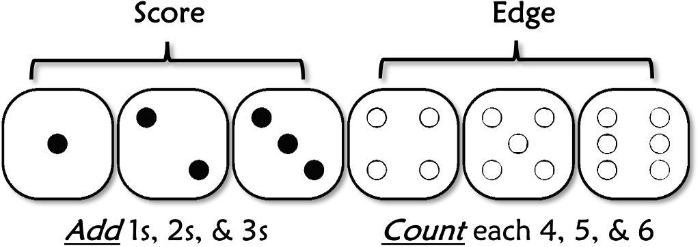

*This chapter explains how METTLE Core settles the outcome of interesting and uncertain actions. Briefly, the dice are an oracle to see what happens and inspire further drama. Roll a pool of dice based on the character's relevant ability to see how successful they were. Failure is rich in dramatic possibilities, so do not fear it.*

## Table of Contents

{: .no_toc}
- TOC
{:toc}

---

## Checks

***Check*** to see if an action succeeds or fails by rolling a pool of dice. This method is the key to the rest of the METTLE engine.

### Success & Failure

To make a Check, declare what the character is doing, then roll dice equal to the Attribute they are doing it with. For Attributes, use CALLING if it fits the task, otherwise default to MOTIVE for mental, NATURE for social, or POISE for athletics.

Add the face numbers of dice showing 1-3; this is the ***Score***. Count the number of dice showing 4-6; this is the ***Edge***. For example, rolling [4, 1, 3, 5, 2, 2] yields a Score of 8 (1 + 3 + 2 + 2) and 2 Edge (4 & 5). Score determines if they succeed, while Edge reveals how well.

 A Check succeeds if the Score equals or exceeds (≥) the ***Difficulty*** of the task. This is a number set by the Guide or a target’s defensive (“passive”) Attribute. Most Checks do not count excess Score, so there is no need to keep adding beyond that. Zero Difficulty is an automatic success, so skip straight to counting Edge in that case.


{: .text-center }
**READING the DICE**

<center>

</center>

<center>
<strong>DIFFICULTY</strong>
</center>

{: .lh-0}
| Difficulty | Ranking |
|:-----------------:|------------------------|
| 1 | Routine |
| 3 | Challenging |
| 6 | Daunting |
| 10 | Formidable |
| 15 | Nigh Impossible |

The more Edge on a success, the better it was. A higher Edge may mean they did it faster, made it harder to undo, yielded more info, improved quality, added special effects, etc. Even on a failure, having Edge lets you propose a Twist to get a second chance.

<center>
<strong>EDGE</strong>
</center>

{: .lh-0}
| Edge | Quality of Success |
|:-----------:|---------------------------|
| 0 | OK |
| 1 | Good |
| 2 | Great |
| 3 | Excellent |
| 4 | Amazing |
| 5+ | Legendary |

The Guide should assume competence and only call for a Check when the outcome is interesting or uncertain. Players should brazenly presume success and only Check if the Guide demands it.

Players may also just assume success if a Pool is higher than the Difficulty. On the other hand, it is impossible to beat a Difficulty higher than three times the Pool. Try something else!

{: .highlight }
>-	Roll a number of dice equal to the Attribute being used.
>-	Add up dice showing 1–3 for the Score.
>-	Count the number of dice showing 4–6 for the Edge.
>-	Check succeeds if the Score is at or above Difficulty.
>-	Edge is the quality of success or potential for a Twist on failure.

{: .note }
don’t be afraid to modify your dice with tape, paint, or washable markers to make Checks easier. The easiest method for most groups is to use dark dice with light pips or numbers, then fill in the 4-6 faces with a dark marker.

{: .note }
The average Score of a single die is 1, making it easy to
gauge chances of success. This also means you can directly contest
single Attributes, using one as the active Check and the other as its
passive Difficulty.

### Check Modifiers

A character may have Bonuses to a Check stemming from good equipment or clever ideas. These add dice to the base pool from the relevant Attribute. For example, “+2D” means add two dice. Die penalties only come from falling into negative Mettle.

The Difficulty of a Check reflects the situation; raise or lower these as needed. For example, “+1 Difficulty” or “-2 Difficulty. This is a tool used by the Guide to set the challenge for players.

{: .highlight }
>- Bonuses add dice to Checks, penalties subtract.
>- Difficulty of the task may raise or lower.

### Twists

These give a chance to turn a failure into a messy success. A player who fails a Check but has Edge may call upon the table for a ***Twist***. The Guide or other Players then come up with a good complication, and the Guide chooses the best one. The player may then re-roll all Edge dice, tallying up the new Score and Edge.

For example, a player Checks 5D against Difficulty 3. They come up [1, 4, 4, 5, 6]: Failure! They call for a Twist and accept it. Keeping their Score die of 1 and re-rolling the four Edge dice, they get [1, 3, 5, 5] and combine it with their old Score of 1 for [1, 1, 3, 5, 5]. The adjusted result is a Score of 5 and an Edge of 2 – success!

Other types of Twists are *immediate setbacks* that apply *regardless of success or failure* and *derive from the fiction*. For example, losing a weapon, breaking gear, harming a relationship, inflicting collateral damage, blurting out something incriminating, etc. These should be directly connected to the action triggering the twist – not unrelated coincidences, however unfortunate.

The Guide and other Players come up with the Twist, not the Player making the Check. ***If the acting Player or the Guide does not like it, either can just call off the Twist and accept failure as the gift it is.***

Guides can also call for Twists for their NPCs. They benefit from player ideas but still hold all the power over what to accept.

{: .highlight }
>- On a failure with Edge, Players or Guides may call for a Twist.
>- Ask the table for a suitable complication then reroll Edge dice.
>- Use the new, partially rerolled result but suffer the Twist.

<center>
<strong>TWIST SEEDS</strong>
</center>

{: .lh-0}
|**Type**|**Example Consequences**|
|---|---|
|Confuse|Lose *trust*: mistaken identity, mistranslation, half-truth...|
|Delay\*|Lose *next Action*: stuck, stalled, distracted, shaken...|
|Dismay|Lose *morale*: lost contact, harm relations with others...|
|Expose|Lose *secret*: cover blown, reveal a secret, leave clues...|
|Imperil|Lose *safety*: friendly fire, obstacle, unwanted attention...|
|Waste|Lose *resources*, use up credit, lose or break items...|

### Twists Flowchart
```mermaid

graph TD
	Fail[Check Fails] ==> Edge{{Have any Edge?}}
		Edge == Yes ==> Twist{{Call for Twist?}}
		Edge == No ==> Fail
	Twist == Yes ==> Table{{Table Twist Acceptable?}}
	Twist == No ==> Fail
		Table == Yes ==> Reroll[Reroll Edge]
		Table == No ==> Fail

```

---

## Procedure
The prior pages offer a superb explanation of how to do things that call for Checks. This page makes it clear just when to use them. The best advice is to use them rarely; only when a random outcome is interesting. Using the dice too much makes them feel less special and slows down the pacing of a Scene.

On the other hand, it is perfectly fine to run an entire game without resorting to a Check! Players should strive shamelessly to get away with narrating as much as they can without even hinting at the need for one. Play it cool. Leave it to the Guide, or other Players to rat you out for a Check when the action seems dubious.

Consider zooming a Check in or out depending on how much focus you want on a Scene. Zooming in calls for more Checks on complex tasks and zooming out can resolve a whole Scene in one swoop. This aids with pacing and is a hallmark of advanced tables.

### Procedure Flowchart

```mermaid

graph TD
	Describe[Player describes attempt] ==> Risky{{Risky?}}
	Risky == Yes ==> Check
	Risky == No ==> Success
	Success ==> Narrate[Guide describes outcome]
	Check ==> Concept{{Fits CALLING?}}
	Concept == Yes ==> Pool[Pool = CALLING]
	Concept == No ==> Default["Pool = MOTIVE for mental
	Pool = NATURE for social
	Pool = POISE for athletic"]
	Pool ==> Roll["Roll dice pool
	Score: add up 1s, 2s, & 3s
	Edge: count 4s, 5s, & 6s"]
	Default ==> Roll
	Roll ==> Test{{Score >= Difficulty?}}
	Test == Yes ==> Success
	Test == No ==> Edge{{Edge?}}
	Edge == Yes ==> Twist{{Twist?}}
	Twist == No ==> Failure
	Twist == Yes ==> Reroll[Reroll Edge dice]
	Reroll ==> Test2{{new Score >= Difficulty?}}
	Test2 == No ==> Failure
	Test2 == Yes ==> Success
	Edge == No ==> Failure
	Failure ==> Narrate

```

---

## Example of Play

This gives you some insight into how to play this game, at least for the parts where you want to use the rules. Your experience may vary because any RPG depends heavily on the group involved. Play with good people and you will have a good game.

The Guide has gotten together with a few good friends as players: *Dana* and *Troy*. Dana is playing Viktor, the embittered ex-fencer from the character creation example. Troy is playing Robin, a cunning and stealthy type.

**Guide:** Ok, so last session you two were trying to sneak into the upper floor of a suspicious antique store. It's midday and you are still in the shop posing as customers, where we left off. There are no other customers now and the clerk is at his desk fiddling with the register. He doesn't seem to be watching you. How are you going about this?

**Troy/Robin:** Is there a door in the shop leading to the upper floor?

**Guide:** yes, there is -- but in the back of the shop in full view of the clerk.

**Troy/Robin:** hmm, I need cover to sneak in there. Any other way...?

**Dana/Viktor:** Well, I'm not much for sneaking around but I can distract the clerk. I look for an item and pretend I am interested. What's in here anyway?

**Guide:** Oh, uh... usual antique store stuff. A set of crystal glasses, a record player, a samovar, an old cash register...

**Dana:** what's a samovar?

**Guide:** kind of a fancy Russian tea kettle.

**Dana:** Oh, Viktor would know that! He has a background that involves Russian culture.

**Guide:** Good enough.

**Dana:** I widen my eyes and say "Just like the one my mother had" loud enough for the clerk to hear.

**Guide:** He perks up quickly and kind of shuffles over to you. He has some sort of limp too, but it is different than yours... unnatural.

**Troy/Robin:** I start to drift over to look at the door but not in a suspicious way. Is it locked?

**Guide:** you can't tell, would have to try the handle.

**Dana/Viktor:** don't get carried away, he is still here. I start talking about the patina on the brass and say I need to see it in the sunlight. "If we can just go out on the porch, so I can check the color in natural light."

**Guide:** Oh, good idea, but he might get suspicious or think you will run off with it, let's do a NATURE Check.

**Dana/Viktor:** My "Itinerant Gambler" CALLING is 6D, which is much better. Can I use that?

**Guide:** Maybe, can you tell me how it applies?

**Dana/Viktor:** err… I guess not, it’s not really gambling or traveling, so I guess I’ll stick with NATURE. That’s “Curmudgeon” with 5D. I start grumpily fiddling with my wallet, maybe I’ll get a bonus if he sees I have cash?

**Guide:** Sure, but you don't look rich either - let's say +1D.

Dana throws the pool of six dice, landing on 3, 2, 2, 4, 4 and 6. This is a Score of 7 (3+2+2) and 3 Edge (the 4, 4, and 6). This easily beats the Clerk’s MOTIVE of 4. The healthy 3 Edge means this should distract him for a good while.

**Guide:** He walks out with you into the sunlight and goes into a whole story about where the samovar came from. You also notice he is squinting in the sunlight and has awfully pointy teeth.

**Dana/Viktor:** Weird, I nod along.

**Troy/Robin:** My time to shine. I try the door.

**Guide:** It's not locked but it is very, very old and creaky. Maybe loud enough to alert the clerk.

**Troy/Robin:** I lift a little to relieve the strain on the hinges and sneak in quietly, as is my way.

**Guide:** Bold but Check POISE - it is very squeaky.

**Troy/Robin:** Cool, at POISE 5, this character has some moves.

Troy throws his five dice, landing on 1, 2, 2, 5, & 6. That's a Score of 5 (1+2+2) and 2 Effect. The Guide had judged this as a 5 Difficulty task, so Robin fails despite his natural prowess!

**Troy/Robin:** But wait, I have two Edge! I want a Twist - anyone have a good idea?

**Dana:** Hmm... you lifted on the hinges, what if the door is so loose it just came off the hinges?

**Guide:** nice, I can work with that. If you fail and make noise, the missing door will make it obvious what you were up to, and if you succeed the shopkeeper might notice a mislaid door.

**Troy/Robin:** Ha... ok I'll take it for the Twist reroll.

Troy grabs the two Edge dice and rerolls them, leaving his original Score dice as they landed. This time he gets a 3 and a 4, making his new Score 8 (1+2+2+**3**) and his new Edge 1 (the 4).

**Guide:** you are perfectly silent, but the door is also perfectly off its hinges.

**Troy/Robin:** I shake my head in disbelief, rest it against the doorframe, and walk upstairs.

**Guide:** Ok. You find yourself in a large empty room with a high ceiling. Soot covers the walls and furniture.

**Troy/Robin:** Soot? Why? You said it has a high ceiling.., I look up.

**Guide:** Ok, you look up and see... well let's move back to Viktor outside.

**Troy/Robin:** Aaaagh no! What do I see up there?

**Guide:** Heh. Ok Viktor, while you are talking with the clerk, he shudders, looks up to the second-story window, then into the store at the door off its hinges. He kind of wiggle-walks back into the store... hissing.

**Dana/Viktor:** I'm going to follow him in and brain him with the kettle.

**Troy/Robin:** It's a samovar, not a kettle! Now what is on the ceiling?

**Guide:** you see...
