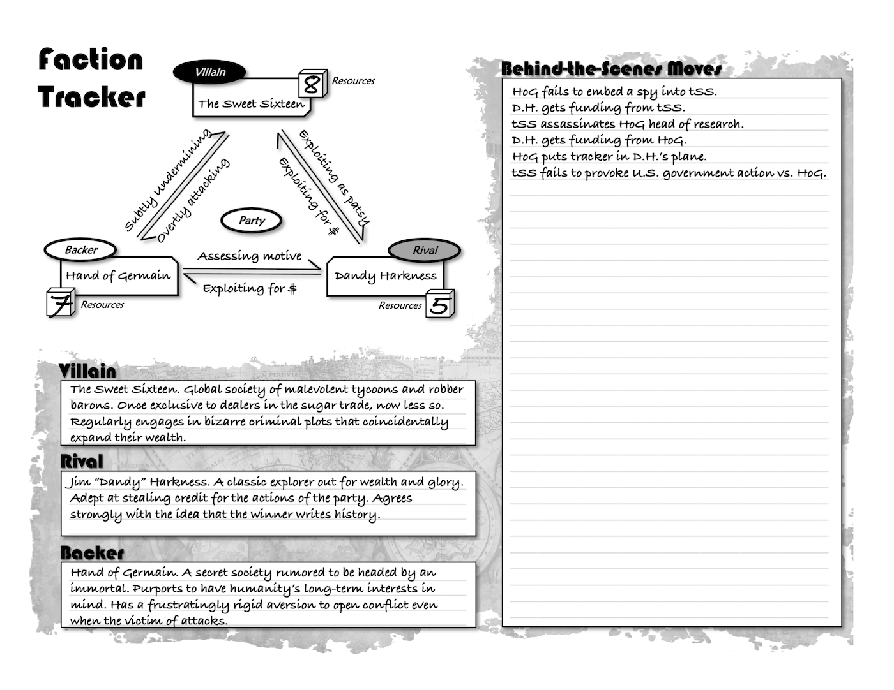

*Opinions vary on how to run an RPG, to say the least. There are plenty of books, sites, and other resources already available and chock full of great advice. This chapter mostly provides specific guidance for running your dream game in METTLE Core. All of it is the author's opinion; you already know you can take it or leave it.*

## Table of Contents

{: .no_toc}
- TOC
{:toc}

## Adventures

Naturally, a Guide running METTLE Core wants a game both they and their
players enjoy. A story they feel like
a part of. A world where their actions matter. For
this to happen, view the game itself as creating an *opportunity* for a
great story to arise, rather than telling one outright.

A good Guide keeps their ego in Check and loosens their grip on the
plot. They become fans of the Player Characters, bringing out their
inner conflicts and extolling their virtues. Given the freedom of a
role-playing game, your players will rarely do what you want them to.
Indulge them, and as they say, *roll with it*.

### Session Zero

It is useful to hold one short session before starting to make
characters and ensure everyone is on board. Reveal what the game is
about, how often you play, any house rules, and how you handle missing
players. Ask them to respect your veto power to limit arguments and help
keep the game fun for everyone. Ask them what they want to see and do,
and what they do not. Listen to them.

A thorough way to cover all the bases is to use
the Five W's: Who, What, Where, When, and Why.

-   **Who** are the characters? International spies? An urban rescue unit? A
    mystery-solving knitting circle? Suggest FOCUS Attributes to help them make characters
    who fit the idea.
-   **What** is the game about? Solve a mystery or crime case? Track down a
    spy? Deliver a precious package? Give them the starting plot.
-   **Where** do the events occur? Baltimore? Bangladesh? A small town in
    Canada? This puts later events in context and makes it easy to add local
    flavor.
-   **When** are the events taking place? Modern-day? The 80's? the Roaring
    20's? The dark ages? This makes it clear what resources are available
    and what state the world is in.
-   **Why** are they involved? Are they banding together in times of danger?
    Offered a prize? Embroiled in a mystery? This helps them come up with
    motives related to the situation.

Many of the old Pulp adventure stories that inspired the genre have just
*god-awful* notions on topics like race and sex. Thankfully, **Safety Tools**
help to avoid unfun or traumatic subjects. These are rapidly evolving, so
search for the best current technique for your group.

If there is time left, start up a short introduction scenario!

### Ongoing Sessions

Here your group explores and changes the setting. Do not fret over
telling a story, following a plot, or even explaining things. Let
everyone, including you, find out what happens next! The party may even
diverge so much from the starting scenario that it becomes an entirely
different game. This is fine. If you feel like the situation lacks
something, try throwing in elements of ***Danger, Mystery, Obstacles,
Consequences, Rivals***, or ***Victories***:

-   **Danger:** planned or random encounters with doom can raise the stakes.
    It becomes possible to lose something precious, often their lives.
    Thugs, wild animals, lawyers, assassins, bureaucrats, repo men, etc.
    This is a common element, *because it is great*, but don't overdo it.
-   **Mystery:** adventurers face the unknown as a matter of course. A
    secret traitor, a shocking clue, a corpse in an empty room, levers in a
    secret lab, etc. Clues should reveal info *and* lead to a new Scene.
    This can even be a mystery to you - just riff on what they discover!
-   **Obstacles:** hinder the party until they overcome a challenge. A
    sealed door, NPCs need a favor, mountains, the demands of fame, etc.
    Puzzles like these help with pacing and engagement with the world.
-   **Consequences:** adventure is a moving target; the party's world
    changes through their action and inaction. A villainous plan proceeds,
    towns rebuild, diseases spread, new powers come into being, etc. This
    gives the Guide the chance to let the setting breathe.
-   **Rivals:** Great minds think alike -- and the party has some
    competition! Rivals should be a credible threat to the party's dignity,
    if not their lives. A Rival also gives the Guide a fun, scene-stealing
    character to play who is not just another enemy to defeat.
-   **Victories:** Let the player enjoy their triumphs. You are their
    biggest fan after all. Their foes henchmen speak their names with dread,
    those they saved grant them favors, movements gain or lose momentum,
    etc. Resist the urge to erase their accomplishments just to drive home a
    feeling of gritty realism.

Be sure to keep an eye open to see which of these your group likes best
but mix it up so they don't get bored or complacent. You also don't need
to have all these things going on, especially at once.

### Final Session

Through the chaos of the ongoing sessions, keep in mind how you could
bring them to a close in a satisfying way. A showdown with the big bad,
reconciliation with family, a great sacrifice, etc. This potential
ending will probably change with every game but it does help you put the
current events in perspective.

### Ideas

When thinking up the rough idea of a game for your players, it never
hurts to scope out adventure-themed books, games, and movies. Take
inspiration from these and make them your own. Subvert them. Ignore them
and do something different.

Some broad plot types to mine:

-   **Great Escape:** Strand or imprison the party, who must find a means of
    escape. Rich ground for forming allegiances and solving puzzles.
    **Examples:** *The Great Escape, Lost, Hogan's Heroes, The Running man,
    Stalag 17, The Count of Monte Cristo, etc.*
-   **Treasure Hunt:** Make the party aware of a lost treasure, fugitive, or
    other irresistible macguffin that could change their lives. Heavy on
    travel scenes, traps, and rival parties. **Examples:** *every Indiana
    Jones, The Goonies, The Good, the Bad, and the Ugly, Romancing the
    Stone, Tales of the Gold Monkey, etc.*
-   **Countdown:** The party learns of a scheme or ultimatum threatening
    what they hold dear. Usually followed by infiltrating the threat before
    directly confronting them. **Examples:** *The Rock, Outbreak, A View to
    a Kill, Moonraker, Dr. Otto and the Riddle of the Gloom Beam, etc.*
-   **Rescue Mission:** The party finds out an important person or creature
    is missing or captured and sets out to retrieve them. This always has a
    cost, whether negotiated with self or others. **Examples:** *Big Trouble
    in Little China, The Wicker Man, Saving Private Ryan,*
-   **Special Delivery:** The party must deliver an important message, item,
    or person. Guaranteed to be a stealth or chase scene somewhere.
    **Examples:** *The Transporter, Pulp Fiction, Children of Men, From
    Russia with Love, Tears of the Sun, etc.*
-   **Whodunit:** Embroil the party in a mystery they must solve.
    These involve lots of Know Checks and player ingenuity, so make sure to drop
    enough clues to keep it moving. **Examples:** *Chinatown, Live and Let
    Die, Clue, The Maltese Falcon, etc.*

Consider that each of these needs a "hook" - a reason for the party to
get involved. For example, a rival lets it slip, it is in all the news,
a superior tells them to ignore it, it results in the death of an ally,
as a loose end from a prior case, etc. If they don't take the hook,
change your bait or fish elsewhere.

As mentioned earlier, do not get attached to a plot. Maybe they use your
setting as a sandbox, maybe as a litter box. Always remember, however,
that you are a kind of player too. if it stops being fun for you, you
can always stop running it for them.

### Faction Tracker

A web of conspiracy influences an adventure party behind the scenes. The
faction tracker is an optional tool that helps the Guide keep track of
three staple ***Factions*** in pulp adventures: the ***Villain***, the
***Backer***, and the ***Rival***. If your setting is different, wing it
or set your own web up on the Blank faction Tracker.

-   **Backer:** a person or group that aids the party. They can be relied
    upon as a helpful contact or for aid behind the scenes.
-   **Rival:** a person or group that competes with the party. Often another
    party with similar means but different methods.
-   **Villain:** a person or group that opposes the party, and vice-versa.
    The main driver of conflict in the game.

{:. text-center }
**FACTION SEEDS**

{: .lh-0}
| Roll | Enemy | Backer | Rival |
|:-----------:|:---------------------------:|:-----------------------------:|:------------------------------:|
| 1 | Zealous Cult | Secret Society | Fellow Adventurer |
| 2 | Sinister Genius | Government Agency | Unpredictable Weirdo |
| 3 | Ruthless Corporation | Wealthy Philanthropist | Sly Trickster |
| 4 | Shadow Conspiracy | Curious Scholars | Bumbling Oaf |
| 5 | Greedy Criminals | Religious Order | Vengeful Ex-member |
| 6 | Aspiring Overlord | Mysterious Voice | Suspicious Investigator |

Each Faction has a box for its name, a cube for its Resources, and arrows for its relationships. Roll 1d6+3 for each Faction, giving the Rival the lowest. Adjust if not satisfied -- these change only from extremely impactful events. The sides of the triangle are bidirectional arrows -- jot down their relation to each other, above and below.

Resources come into play when factions deal with each other. For example, the party's Rival may try to finagle their Backer into lending him a helicopter originally meant for the party. The Rival Checks their Resources vs. a Difficulty of the Backers' Resources. A Twist defaults to them dealing with the fallout from their plotting instead of taking part in the next Faction turn.

{:. text-center }
**FACTION RELATIONS**

{: .lh-0}
| Roll | Relation | Elaboration |
|:-----------:|--------------------|:--------------------------------------------------------------------|
| 1 | Colluding | Working with them as collaborators, secret or open. |
| 2 | Extorting | Forcing them to do something or face dire consequences. |
| 3 | Undermining | Subtly deteriorating their power and reach. |
| 4 | Evading | Hiding, fleeing, defending, and evading conflict. |
| 5 | Attacking | Hostile and actively trying to destroy by whatever means. |
| 6 | Appeasing | Giving them what they want, to curry favor or halt attack. |

{:. text-center }
**FACTION TRACKER**

### Powers

METTLE Core embraces weirdness but keeps a little distance from overt
magic and super-science. These numinous mainstays of pulp fiction are
often still present, but secret and special. If they appear, they tend
to be plot elements: inventions of mad scientists, alien devices, or
villainous sorcery. For example, a stolen idol that calls rain, a death
ray, cultists summoning a loathsome entity from beyond, the holy grail,
a gorilla with a human brain, etc.

You can run these as narrative trump cards that simply break or glitch
reality, very fancy special equipment, or as full characters in their
own right. If players get ahold of them, let them have their fun. In the
long run, they can always run out of charges, have disastrous side
effects, be confiscated by "top men," etc. There are other games and
settings made for those who regularly traffic with such forces.

## Characters

An expected feature of this genre is the characters are always changing
or evolving. Players may want to change their character's Attributes,
Tags, Contacts, Gear, etc. After the first game, you should even
recommend this so they can make a character who works for them. In later
games, ask for some justification but be lenient. No one should feel
trapped by choices they made before becoming familiar with the rules,
setting, or story.

Sometimes a new character comes along, or old ones die or retire. A new
character should start with an Attribute pool total (highest x 2 + all
lesser pools) equal to the lowest in the group. Discuss how to work them
in; ideally by linking them to the current situation. A surviving
villain makes a great replacement character and saves time on
introductions. This is also true of their henchmen or any other
interesting NPCs the party hasn't entirely alienated or deceased yet.

While it is always best to have everyone at each game, things happen.
Missing players can still get XP by recalling their highlights from the
last session they attended. They can also get a bonus "make-up" XP for
each missing session by explaining what brought them back into the
story.

### NPC Creation

The Guide plays perhaps *too many* NPCs, such as friendly or unfriendly
contacts, shopkeepers, enemies, key figures in the setting, and random
passersby. Only key NPCs should have full Attributes. For the unnamed, a
single ***NPC pool*** will do for Attributes *and* Mettle. Think
"Stunned Bystander 3D" or "Hostile Village Elder 5D." If they try
something out of character, double the Difficulty as usual. If one of their
Attributes is far higher, such as FRAME
for a large creature, list it in parentheses.

### Freeform CONCEPT Descriptors

METTLE Core gives thematic examples but does limit players to a
definitive list of skills to choose from. While specific settings may
hint at good ones, these are supposed to be up to the Player. You decide
if a given CONCEPT is relevant to a task.
Most of the time, you should say yes. If it is not obvious why and the
Player doesn't have a clever explanation, they should default to about
half their dice pool. In extreme cases, do not allow the action at all.
Suggest other ways the party might achieve their goal if they are stuck.

### Freeform XP

This method can be freeing for many groups but confusing for others.
Players are meant to choose for themselves what they felt was XP-worthy
about the last game and provide a useful recap while they are at it. If
you feel the urge to reward a player with XP, consider doing this more
directly by changing the way the scene plays out instead.

Some consider this method controversial. If you are one of them and this
freeform XP does not work for you, patch in a more traditional set of
rewards from other games. keep them within the same range of 1-3 XP per
session and there should be little trouble.
