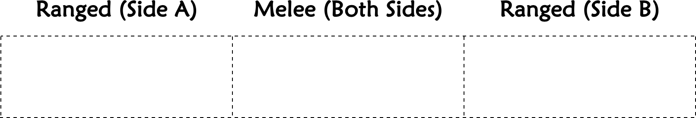
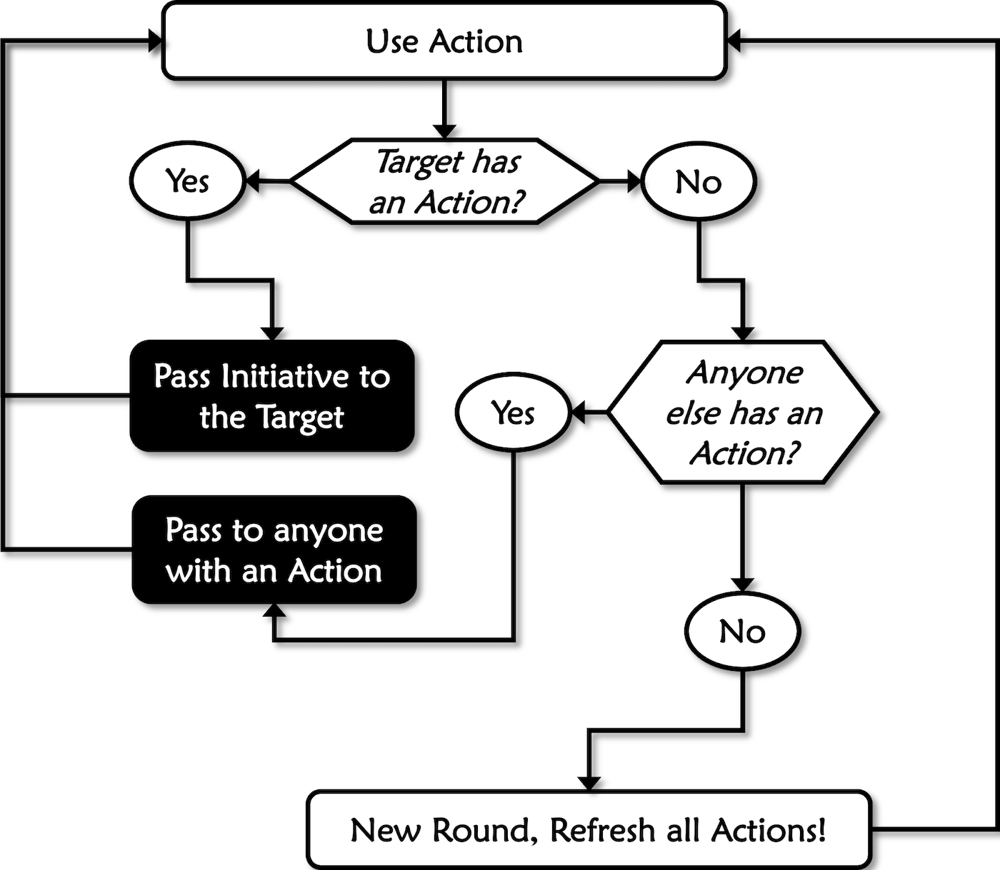
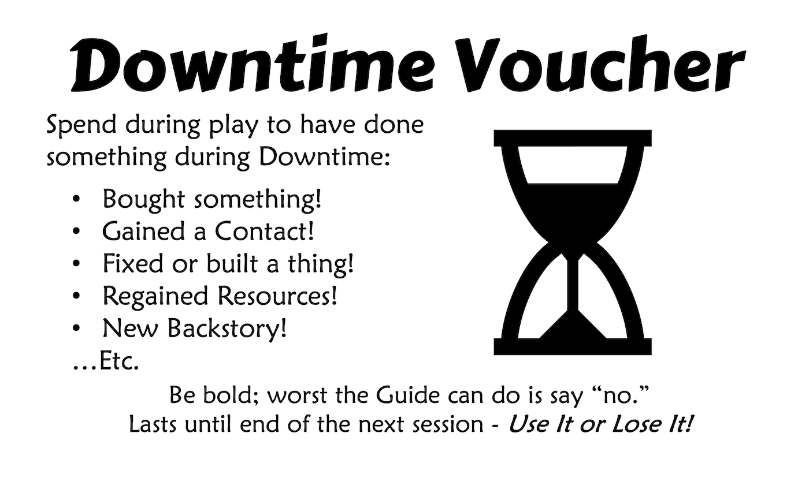

*An RPG is a different beast than theater, but some of its familiar terms can be useful for keeping track of things. If your gaming group enjoys certain types of scenes, steer the game towards more of them. If lucky and creative, they may find themselves in unusual situations not described here. In those happy cases, you are on your own.*

## Table of Contents

{: .no_toc}
- TOC
{:toc}

---

## Staging

A ***Scene*** is an imaginary slice of time and space for holding in-game events, such as a tense negotiation with suspicious police or a frantic chase through the jungle. They are tools to help organize play while retaining enough flexibility for the table to express their own style. This section describes the background parts of a Scene helping everything else run smoothly, such as time, space, and player spotlight.

### Time

The amount of time a given scene takes in the game world is flexible and depends on what ***Actions*** the Players and Guide are using. Fast-paced feats like fighting and sneaking only take seconds or minutes. Lengthy events like traveling and recovery can take days or weeks in-game. To the players themselves, most Actions should take about the same amount of time to resolve, barring disagreements.

This game uses real-world time measurements like days, weeks, months, etc. A notable exception is ***Rounds***. These are about six seconds long and come in handy for fast-paced combat Scenes after Initiative comes into play.

Less formal means of measuring time can include ***Session***; the entire real-life game day, or ***Campaign***; a series of Sessions. Don't get too hung up on time unless there is something urgent creating pressure.

### Distance

Measure distance in ***Zones*** for most Scenes. These are flexible spaces, but usually about 10 square meters and 5 meters high. A small closet can be a Zone, as can an amphitheater. Split large areas into several Zones to keep things sensible. Zones can have interesting features or ***Scenery*** (p.52), such as cover, traps, obstacles, etc.

Characters get a free move into an adjacent Zone as part of their Action. This is called a ***Charge***. They only need to spend their Action to Move if hindered somehow. Some creatures or vehicles can move more Zones in a Round, up to their ***Speed***.

Range and movement vary depending on how many Zones an area holds! Small, cluttered areas are hard to aim around or move through. In these, the effective range of a move or weapon is not going to be as ideal as it would be on a spacious flat plain.

Races use long Zones called Stretches, each about a half mile. These also replace Rounds as a unit of time during a race.

Sometimes you just want a quick zone setup for an encounter. In this case, just draw a square or circle in the middle for melee combatants to duke it out and a zone to either side for ranged combat:

{: .text-center}
**QUICK ZONES**

### Initiative

Combatants each get on Action in combat, and Initiative decides when they can spend it. Briefly, acting characters pass the next turn to their target, only choosing another if their target has no Action.

- **Start**: The one who calls for the first attack seizes Initiative, becoming the first holder. If this is disputed, the Guide should err towards giving PCs the privilege. Time is then split into 6-second rounds, and everyone gets an Action to spend within them.
- **Main**: Initiative then passes from the current holder to the target of the Action, whether enemy or ally. They become the new holder and get to act next. If the target has no Action to spend, the holder must instead pass it to someone who does. If the Action was targeted at oneself or has no apparent target, the holder also just passes it to anyone with an Action.
- **End**: When everyone has taken their Action, a new Round begins. Everyone gets their Action back, so the last one to go can now pass Initiative to their target (or choose, if not applicable).

Normally, combatants must take their turn when chosen. One may Wait by selecting a specific Action, such as “Attack” and holding off until the right moment. They may use their Wait Action any time later, even interrupting someone else’s. They cannot change the type of Action. If no opportunity arises, they choose at the start of the next Round to keep waiting or rejoin the regular Initiative scheme.

Surges restore the character’s Attack Action that round and make them eligible for Initiative again. A surging combatant must have acted already and have least 2 Mettle.

Initiative ends when the conflict is over, by whatever means.

{: .highlight}
>- First to declare Action triggers Initiative.
>- Target goes next, if they have an Action.
>- Otherwise, pick anyone else with an Action.
>- New Round when no one has Actions left.

{: .text-center}
**INITIATIVE**

### Downtime

Sometimes a Scene will take a long time, perhaps days or months. This is common when recovering negative Mettle, undertaking a long project, or traveling. Those not involved may wonder what they are doing during that time. The Guide will be tempted to ask: “So what are you doing while your buddy is healing up?” Resist this banal urge. The problem is this tends to lead into an impromptu adventure leaving out those tied up in the long action, or worse, a lengthy argument about how they fill their time.

METTLE Core is an action-packed game about boldly pressing ever onward, not micro-managing leisure time. Those engaged in a long action are advised to play a spare PC or NPC if the rest of the table absolutely must sally forth to their doom or glory.

Better, every party member fit enough for mischief during a long break should just accept a Downtime Voucher instead. This is a token their Player can spend later to retroactively reveal something helpful they did during the Downtime. For example, bought a speedboat or added a new feature to their utility belt. These are used during play, and if used cleverly they can be real lifesavers.

{: .highlight}
>- Those not involved in a long Scene may get a *Downtime Voucher*.

---

## Actions

Most games spend a good amount of time resolving *Actions.* While it is fun to role-play these out to the hilt, it would be unfair to demand that a player be good at them *personally*. At a minimum they should describe what they are doing and let their character's abilities fill in the rest.

Do not fret if you run into events in the game that genuinely call for a Check but are not listed here. Just as described in the Checks section; find a likely Attribute for the pool, take a guess at the Difficulty, and make up your mind about what success and failure mean. Then just throw the dice. If it's something you end up doing a lot, save some time by writing up a formal Action for it. The ones to follow are just the most common actions, pre-baked so you don't have to cook them up from scratch every time.

The default Twist for Actions is Delay, meaning they lose their next Action because they are still dealing with the consequences of their last. The Outcomes section of each Action also lists a few likely alternate Twists to liven things up. These are not exhaustive, and many other possibilities exist. Be creative!

### Attack

Adventurers get a lot of mileage out of bone-headed violence, so learn this Action well. Check NATURE for melee Attacks and CULTURE for ranged Attacks, always vs. the target’s POISE. If successful, they inflict the weapon’s DM plus any Edge as damage. If a CALLING includes the name of a weapon or fighting style, they may use it in place of NATURE or CULTURE.

**Check** NATURE vs. POISE for melee, CULTURE vs. POISE for ranged.

{: .outcomes }

> -   **Success:** Hit and inflict the weapon's DM on the target.
> -   **Edge:** *adds to DM.*
> -   **Failure:** attack misses or target evades.
> -   **Twists:** *lose next Action in confusion, drop weapon, hit unintended target instead, run out of ammo, break weapon, accidentally lose Cover, jam weapon, attract more foes to the battle, etc.*

-   **Melee Attacks** are close combat strikes on a foe in the same Zone. Narrate these as decisive strikes or flurries of blows, depending on the character’s fighting style or weapon.
-   **Ranged Attacks** fire through Zones up to their Range. Every Zone beyond is a cumulative +1 Difficulty. Double range by Aiming but suffer half POISE until next Action. A single Attack may represent multiple shots, especially with firearms.
-   **Area Attacks** apply the same Score vs. base Difficulty 0 to everyone in the target Zone to see who takes the damage. Pass Initiative to any survivor with an Action. If none, choose elsewhere.
-   **Disarm Attacks** remove a weapon from the foe’s grasp instead of doing damage. The spared damage must have been high enough to have otherwise put them into negative Mettle.
-   **Grapple Attacks** hold, grab, or pin a foe. Instead of doing damage, each unsoaked point inflicts +1 Difficulty to their next Action. Armor and weapons do not usually count for either side.
-   **Shove Attacks** push or pull a foe into something or out of a Zone instead of doing damage. The spared damage must have been high enough to have otherwise put them into negative Mettle.
-   **Split Attacks** divide the dice pool between two different targets. Each must also be aimed at a different target. Any modifiers affect each split pool separately. Pass Initiative to any surviving target who has an Action, if none choose elsewhere.
-   **Vehicle Attacks** like ramming work much like regular Attacks but factor in current Speed. See Vehicles section in Resources for details.

### Heal

This is for life-or-death trauma well beyond bruises and stitches. As such, it works only on those who have dropped to 0 Mettle or below. Heal is a Check of CULTURE vs. Difficulty 3, lower if in a hospital and higher in unsanitary conditions. Success means they are stable for the time being. Edge heals negative Mettle over the course of a day’s rest. Failure means the character dies.

**Check:** CULTURE vs. Fiat Difficulty (usually 3)

{: .outcomes }

> -   **Success:** the patient is alive and somewhat stable.
> -   **Edge:** each point restores a point of Mettle after a day's rest.
> -   **Failure:** patient succumbs to their wounds or died before the aid.
> -   **Twists:** *patient disfigured, lost a part, wasted gear or surgical tools, arrogant healer aggravates everyone, etc.*

Staggered (and even Fallen) characters can attempt this Action to recover on their own but their chances are slim due to the die penalty for negative Mettle.

If a character is too debilitated, the best thing to do is switch to an alternate character for a while. As payback for everyone’s convenience, the Guide can just handwave their recovery by next campaign.

### Know

There is a difference between what a player knows, and what their character does. This can go either way. When in doubt, players may ask the Guide if their character would know something. For example, what car an obscure salvaged auto part fits in, the weight of a fugitive murderer from their footprints, or who has a revealing “tell” when gambling. Know is a Check of MOTIVE vs. a fiat Difficulty for facts, or vs. MOTIVE if used to gain insight into a person. Success means the Guide gives them extra information.

**Check:** CALLING vs. Difficulty (or vs. MOTIVE if a person)

{: .outcomes }

> -   **Success:** Guide answers the question in line with the character's best understanding.
> -   **Edge:** Answers more questions or finer details.
> -   **Failure:** Guide tells what their CALLING should know outright.
> -   **Twists:** *Delay, half-truth, target alerted, one wrong clue, etc.*

The Player should frame their question carefully if they want useful info, and Guides should be generous with answers! Having the right CALLING or MOTIVE often grants information without a Check. Always err towards giving out information to keep the game moving.

This Action helps to understand, not perceive. As such, Know does not detect traps, loot, lies, or ambushes. Hidden foes rely on their Sneak Check, and hidden Traps are treated as Hazards with their own Check. In other cases, the Guide should just tell the players what is there without gating it behind a Check. A thorough search should reveal just about anything, for example.

### Move

Enters an adjacent Zone. This is usually done with a free move called a Charge, which does not use up an Action unless hindered somehow. More complex moves like ducking through brambles, swimming, clambering over debris, etc. may call for this Action and a Check of POISE vs. a Difficulty set by the Guide.

**Check:** POISE vs. Difficulty

{: .outcomes }

> -   **Success:** Overcome obstacle or trap.
> -   **Edge:** compare to see who got there first.
> -   **Failure:** Stopped by an obstacle or triggered trap.
> -   **Twists:** *drop item, cause a hazard, reveal location, etc.*

Creatures or vehicles with a higher Speed can Move that many Zones in a Round. If they face multiple obstacles along their path, add up the Difficulties – on a failure use their Score to see how many they passed. Slow movers with fractional speeds (1/2, etc.) take two Moves or more to cross a single Zone.

- **Obstacles** like walls, rivers, brambles, etc. hinder movement into the Zone. For example, hurdling a broken wall to enter. These usually provide Cover (p.56) to those who cross them.
- **Climbing** lets one enter Zones that extend up or down, like cliffs, pits, or large vehicle/creatures. Very large creatures or vehicles may present their own Zone(s) to climb, making it possible for the bold to deal with riders, find entry ports, etc. Difficulty is the large creature’s POISE or vehicle’s max Speed.
- **Chases** have the quarry and pursuers Move through a set of chase Zones, with the quarry deciding where to go. How well they overcome obstacles, hazards, and climbing along the way decides who wins.

Surges grant an extra Action, but not higher Speed. The maximum Move in a Round is still equal to Speed. A Surge still grants another chance to climb, chase, or overcome an obstacle.

### Race

High stakes race or chase scenes often benefit from some structure. After dealing with obstacles and dirty tricks, the driver reaching the end with the highest Speed wins. If tied for Speed, the highest Edge wins. Race Checks are POISE vs. current Speed, with obstacles adding Difficulty.

**Check:** POISE vs. current Speed

{: .outcomes }

> -   **Success:** Maintains control and keeps pace with the Speed group.
> -   **Edge:** Their lead on other racers or spent on Stunts.
> -   **Failure:** 1d6+Speed crash damage to vehicle and occupants.
> -   **Twists:** *Delay (drop 1 Speed, falling out of current group until next stretch), waste fuel, lose parts, mod fails, etc.*

A Race expands Zones into much longer stretches of track, each about half mile long and lasting a minute or so. All racers make their checks and compare Edge for the lead. Lead mostly matters in the final stretch, until then Edge can be spent on the Stunts below. These are decided after everyone makes their Check and do not require Initiative. Mixing and matching Edge on different Stunts is allowed:

- **Muscle**: aggressive maneuvering hinders another driver’s Stunts. Spent Edge reduces the Edge of another driver in the same stretch. This can be done at any time to cancel someone else’s Edge Stunt on a one for one basis.
- **Splatter**: skid up mud or dirt onto the target vehicle with the same lead or lower. Edge inflicts +1 Difficulty due to low Visibility (max +4) for everyone on the vehicle until each of them cleans it off with an Action.
- **Steady**: races are so intense the driver and passengers cannot normally act. Each Edge spent smooths out the ride so the driver or a chosen passenger may take their Action during the Stretch.
- **Swerve**: juking or angling, Edge inflicts +1 Difficulty to Attacks made on the vehicle until the next Stretch.

The Steady Stunt above allows a selected driver or passenger to make Attacks, maximum one per character just like a Round. This does not require Initiative as not everyone has a chance to act. Ramming or sideswiping is an Attack.

### Rally

Shaking off the pain, standing up on their hind legs, and putting their guard back up. A Rally doubles current Mettle, up to the maximum. Current Mettle must be higher than zero (1+) to Rally.

A Rally is most effective at half Mettle, less so when higher or lower. When to Rally is an important tactical choice, made easier if one has strong allies or cover to provide breathing space.

### Rattle

Taunting, threatening, trash-talking, or demoralizing a foe makes it harder for them to focus. This is only effective if they can grasp the indignity of it. Rattle is a Check of NATURE vs. MOTIVE, but a spiteful, authoritative, or comedic CALLING can do. This inflicts the ***Rattled*** Status, forcing them to discard their lowest die or dice on any Check.

For example, a Rattled combatant makes an Attack Check and gets [2, 2, 4, 5, 5, 6]. They must discard the 2s and now have only Edge, meaning they have no Score and fail.

Foes discombobulated in this way often surrender or flee.

**Check:** NATURE vs. MOTIVE

{: .outcomes }

> -   **Success:** Target is Rattled (discard lowest) on their next Action.
> -   **Edge:** *effect lasts until after another Action.*
> -   **Failure:** target keeps their cool somehow.
> -   **Twists:** *reveal secret, offend ally, draw more foes, etc.*

Using some sort of revelation or dirt can grant a bonus. For example, revealing the target’s partner was unfaithful, they made a mistake, are surrounded, etc. True or not, it must be something the target would care about. Events in the game or the Know Action may reveal these. Some may only be used once; this is a tricky tactic and should be treated sensibly at the table.

A rattled target cannot be rattled again until it wears off.

### Sneak

Moving silently and hiding in shadows are great ways to evade foes and get into forbidden places. This is purely narrative until the sneaker risks being discovered; at that point this Check is called for to remain unnoticed. It is not possible to hide in plain sight without some form of invisibility or technological trickery. Sneak is a Check of POISE vs. MOTIVE, or the highest MOTIVE of a group.

**Check:** POISE vs. MOTIVE

{: .outcomes }

> -   **Success:** Remain unnoticed by your foes.
> -   **Edge:** Adds to DM during Surprise, steal or plant more small items, etc.
> -   **Failure:** They notice you.
> -   **Twists:** *Delay, leave telltale clues, end up in different area, drop gear, etc.*  

-   **Hiding** is a matter of finding Cover rather than a checked Action. If their seekers move into a position where the Cover would fail, the hider can try a Sneak Check to slip away. The better the hiding spot, the less likely they will need to slip away from it.
-   **Surprise** attacks can trigger after a successful Sneak. The surprised side goes a Round without an Action. Next Round things go back to normal for the survivors.
-   **Steal/Plant** small objects, with Edge adding extras. Good for framing a suspect, snitching a set of keys, leaving trackers, live grenades, etc. Often done instead of an Attack or Defense, leaving the seemingly victorious foe unaware of their loss or gain.

{: .note }
**Group Option**: Normally, the whole party makes individual Checks when sneaking. This can get a little tedious, makes failure all but certain in large groups, and may trigger an ugly blame game amongst players. To avoid this, the Guide may have only the character with the lowest pool make the Check. In case of ties, they may decide amongst themselves.

### Sway

Haggling, seduction, diplomacy, lies, threats, bribery, and negotiation are all good alternatives or preludes to battle. This is not mind-control and merely shifts the social situation in favor of the winner. Sway is a Check of NATURE vs. MOTIVE. The side with more leverage may get a bonus or better narrative outcome.

**Check:** NATURE vs. MOTIVE (or highest MOTIVE of an audience)

{: .outcomes }

> -   **Success:** The social situation sways in your favor.
> -   **Edge:** Adds to Difficulty to persuade otherwise later.
> -   **Failure:** The social situation plays out as it would.
> -   **Twists:** *lose Contact, offend ally, reveal secret, etc.*

Success shifts the narrative for the better, but the views of those involved still depend on the actual argument. If no one uses Sway, the Guide role-plays the reaction as they would expect it to play out.

Edge makes it harder for others to undo the persuasion later. Note this sticky belief in the Resources section of their character sheet; it is now something they “own,” for better or worse.

Players on the losing side of persuasion can either go along with it or outright reject the manipulation outright. Going along with it can easily justify an XP highlight!

### Travel

Traveling between areas often just serves as the narrative opening of a new scene. This is perfectly fine. For example, "*After a bit of the usual traffic on I-95, you find yourselves eating crabs at the Bulging Bushel*." If the journey is as important as the destination, use this Action to give it more weight. The players get to make decisions and the Guide gets to add drama with encounters!

METTLE Core defaults to a sort of point-crawl system when needed. The Guide, and sometimes the Players, will lay out points of interest or “stops” on the map. They then draw the path lines between them and assign each path a Difficulty based on the danger of the journey. This is meant to simplify, not restrict. Parties who want to go somewhere else can always “drop a pin” and set an unplanned destination later. See the example adventure for an example.

A single Travel Check can stand for hours, days, or weeks depending on the distance and vehicles. Adventurers “travel on their stomachs,” so lacking rations inflicts Deprivation and can turn a poorly planned expedition into a macabre tableau of sun-bleached skeletons for future explorers to puzzle over.

The lead traveler then Checks POISE – or their best navigation or area knowledge CALLING, vs. the path Difficulty. Success means the group arrived safely, and failure is an encounter along the way.

**Check:** POISE vs. Difficulty

{: .outcomes }

> -   **Success:** arrive at destination safely.
> -   **Edge:** *compare to beat rival parties or foes to destination.*
> -   **Failure:** arrive at your destination if you survive an encounter.
> -   **Twists:** *need extra day to get back on track, get lost and move to an adjacent hex, roll another encounter, worse encounter, ambushed at the destination, lose supplies or goods.*

An ***Encounter*** is an event rolled or chosen by the Guide. Whether enemies, obstacles, fortune, or misfortune, they tend to eat up precious time and resources. Examples include running across a hostile patrol, becoming fatigued, getting a flat tire, or finding a mysterious statue. Even on a success, the Guide may want to roll on an encounter table and describe the telltale signs (tracks, noises, spoor, etc.) of what they would have faced.

Rivals or foes can Travel too, giving them their own Edge result. The highest Edge arrives first, which can be important for staking claims or laying ambushes.

### Use

This catch-all Action covers miscellaneous feats, normally using a device, tool, or item. Pulling a sticky lever, forging a famous painting, starting an unfamiliar vehicle, fixing a car, picking a lock, etc. For trivial but Round-consuming Actions like reloading a weapon or pulling a lever, this is usually unchecked. When necessary, Check a suitable CALLING or the most relevant of MOTIVE, NATURE, or POISE vs. a fiat Difficulty.

Longer projects like auto repairs or picking a complicated lock are not necessarily more difficult. These are better handled by requiring a certain amount of Edge before they are completed. Some tables like to keep track of this by making a progress bar or “clock.” It may take several Checks to build up enough Edge to complete the Use project.

**Check:** MOTIVE, NATURE or POISE vs. Difficulty

{: .outcomes }

> -   **Success:** Completes the task as intended, may or may not be *complete*.
> -   **Edge:** fill in progress bar or clock for longer tasks.
> -   **Failure:** task fails and must be restarted from the beginning.
> -   **Twists:** Delay (gonna need more time here!), break tools, attract
>     unwanted attention, weird flaw, lower Resources., etc. \*

A party may split a lengthy Use project into smaller ones with varying Difficulties. This allows for incremental progress and taking advantage of specialized assistants. Naturally, the more people in a cohesive team working on a project, the less time it will also take.

---

## Scenery

This section describes extra features to spice up a Scene.

METTLE uses ***Hazards*** to handle ambient damage from the Scene itself, like fire, poison, etc. These use an abbreviated Pool + Bonus, such as 3D+3 (3-6 damage) or 5D (0-5 damage). Hazards are usually Difficulty zero, so skip straight to counting Edge. If an ongoing Hazard like fire or poison rolls no Edge (before Bonus), it ends.

### Affliction

Adventurers must beware of venomous snakes, blowgun darts, the miasma of the tomb, and “mickeys” slipped in their drink! While a bit slow-acting for most combats, these impart dreadful urgency to longer scenes. Afflictions are Hazards with a Pool and Bonus based on their potence, versus 0 Difficulty – just count Edge.

When exposed, the Guide Checks Potence as a Hazard and Soaks with the victim’s FRAME for poisons, or nothing for disease. Any unsoaked Potence result means the victim takes on the ***Afflicted*** Status, which adds Difficulty to all Checks equal to the total unsoaked Potence.

Check again each Round or other time ***Interval***. If the Affliction +Difficulty exceeds the victim’s max Mettle, they die. If soaked entirely or no Edge is rolled, stop Checking the Affliction but keep the +Difficulty as-is until next Scene.

A Know Check may suggest a ***Treatment***, clearing the Status.

<strong>SAMPLE AFFLICTIONS</strong>

{: .lh-0}
| **Source**          | **Potence** | **Soak** | **Interval** |
| ------------------- | ----------- | -------- | ------------ |
| Common cold         | 2D          | \-       | Week         |
| Monitor lizard bite | 3D          | \-       | Day          |
| Curare dart         | 5D+5        | Frame    | Minute       |
| Rattler venom       | 3D+3        | Frame    | Hour         |
| Cobra venom         | 4D+4        | Frame    | Hour         |
| Tranquilizer dart\* | 4D+4        | Frame    | Minute       |

'* *Less lethal, death at 2xMettle.*

For poisons, the dosage can be adjusted for the victim’s FRAME size. For example, the Potence for a tranquilizer dart must be at least 6D+6 (6-12) to affect an 11 FRAME elephant even slightly.

### Cover

Combatants can use nearby obstacles to protect themselves, referred to as taking ***Cover***. The player must call this at the start of their Action, and the Cover must be in their current Zone. There are three ways to use Cover: Partial, Total, and Guard.

- **Partial Cover**: defender gets +2 POISE defense from incoming attacks, including area and melee.
- **Total Cover**: defender takes no damage from incoming attacks but cannot attack them either.
- **Guard Cover**: protecting character takes -2 POISE defense and the protected gains +2. This can be called on either of their rounds as long as they both agree and are in the same Zone.

Combatants may switch between these at the start of their Action. Popping out of Total Cover to attack a foe is common but downgrades it to Partial until their next Action.

Cover depends on where the attack is coming from. For example, a stone wall only grants Cover against those on the other side. A chain link fence grants full Cover against throwing axes but only partial against gunshots, etc. If Cover is easily penetrated by an attack, it can only ever count as Partial.

### Falls

Treat as a Hazard with a Pool and Bonus of 1D+1 for every meter fallen. Difficulty is 0 so skip to counting Edge. Soak falls using POISE instead of FRAME. For example, being pushed out of a 5 meter second-story window is a 5D+5. The maximum fall damage is 15D+15.

The truly daring may ***Plummet*** onto an enemy below, applying up to +2 DM of the falling distance above to damage. The diver still suffers their own falling damage. This is also a good rule of thumb for dropping a weighty item on someone below.

### Fire

Fire is a Hazard with a Pool + Bonus based on the size and temperature of the fire. Difficulty is 0 so just skip to counting Edge. For example, a campfire is 2D+2, a raging Bonfire 4D+4, a super-hot forge 6D+6, etc.

Flammable targets take ***Burning*** Status, meaning they cannot Rally and continue to suffer the Hazard each Round until it fails to roll Edge. Extinguishing a fire requires a Use Action and some way to put it out, such as water, rolling on the ground, or a fire extinguisher.

### Status

Other status effects exist to vex characters aside from the usual Staggered and Fallen conditions. Most are awful but temporary, lasting until their source is removed or addressed. Record them on the upper right-hand corner of the character sheet in the “Other Status” box until then.
- **Afflicted**: suffering from poison or disease. Add +Difficulty equal to unsoaked potence and may move on to a worse Status next.
-   **Blinded**: Cannot see or perform tasks reliant on sight, such as reading. Checks less reliant on sight are at +4 Difficulty. Others may use Sneak against them as if they have Cover.
-   **Deafened**: cannot perform hearing-related tasks, like listening to speech or music. Sign language or lip-reading may make up for this. Others may use Sneak against them as if they have cover.
-   **Encumbered**: Carrying more gear weight than their FRAME allows. Take a general +1 Difficulty and -1 Speed (to a minimum of 1).
-   **Fatigued**: tired and vulnerable to simple mistakes. This applies a minimum Difficulty to any task equal to 1 for each day of poor sleep or 2 for each day of no sleep. As a minimum, this only affects the Difficulty of a Check if it is higher than the normal one.
-   **Incapacitated**: unconscious or paralyzed. A safer version of Fallen. POISE drops to zero and they lose their Action.
-   **Rattled**: dismayed by a Rattle or other trauma. Prevents Rallies and Surges on their next Action, or more with Edge.
-  **Shaken**: hesitant or afraid. This forces them to discard their highest die or dice on any Check.
-  **Starving**: every day without food lowers maximum Mettle by one. This can be deadly if it drops them to 0 or below. Restored by food.
-  **Suffocating**: characters lose a point of Mettle per Round while holding their breath, or every two Rounds if inactive.
-   **Surprised**: caught unawares, you do not get an Action for the first Round of Initiative. Next Scene, you are no longer Surprised, and this effect ends.
-   **Hungry:** each day without food inflicts +1 Difficulty to all tasks. When the Difficulty plus exceeds their CALLING, they have starved to death. A hungry character may alienate others due to irritability as a Twist.
-   **Thirsty:** each day without water inflicts +2 Difficulty to all tasks. When the Difficulty plus exceeds their CALLING, they have died of thirst. A Thirsty character may faint as a Twist.

### Traps

Traps are sinister surprises for daring adventurers; faceless, “ambient” dangers without their own will. Narrative clues can betray their presence to savvy players. For example, tiny pinholes in the wall, footprints, bloodstains, etc.

Failing that, every trap has a ***Trigger***, such as walking down the hallway, turning a door handle, etc. When triggered, the character has a chance to avoid it: the trap is a Hazard but Checks versus POISE like a regular Attack, with only success inflicting the damage or effect.

-  **Anti-personnel mine:*** A buried mine waiting for a foot, or a claymore awaiting a tripwire. Triggered by the first to walk onto it, and very difficult to spot. *6D+8, Blast targets all in that Zone.*
-   **Flooding room:** this small adjoining room has a strange idol in the
    center. If players linger, the doors close and it begins to fill with
    water, flooding entirely in 5 Rounds. If anyone kneels before the idol
    the water drains away.
-   **Pitfall:** a carefully weighted trapdoor covers a shaft down to the
    next floor. Triggered by the first one to walk onto it, anyone nearby
    could also blunder in. *4D+4, as Falling damage.*
-   **Scything blade:** a pressure plate in the hallway triggers a massive
    hidden blade to swing towards the victim. The victim hears a metallic
    whirring at head height and has a split second to get horizontal and
    avoid decapitation. *5D+7, regular damage.*
-   **Tripwire:** stout twine between two trees around the bandit camp sets
    off a crude tin-can alarm. *4D, alerts the lookouts.*

An obvious “trap” such as an open pit or mine laid out in the open is more of a hazard the party may just choose to avoid. Some are still irresistible to the overly curious.

### Visibility

Darkness, underbrush, or smoke can hinder actions reliant on sight. In general, dim light inflicts a +1 Difficulty, regular darkness +2, and total darkness +4. Equipment such as torches or night vision goggles can reduce these, unless dealing with smoke. Sudden flashes of bright light can also reduce visibility.
