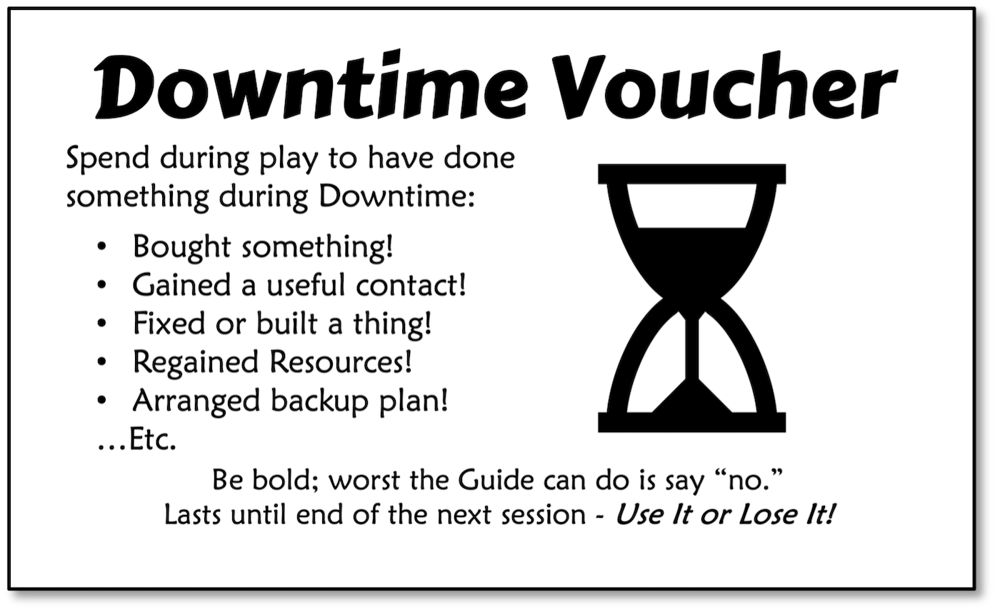

*An RPG is a different beast than theater, but some of its familiar terms can be useful for keeping track of things. If your gaming group enjoys certain types of scenes, steer the game towards more of them. If lucky and creative, they may find themselves in unusual situations not described here. In those happy cases, you are on your own.*

## Table of Contents

{: .no_toc}
- TOC
{:toc}

---

## Staging

A ***Scene*** is an imaginary slice of time and space for holding in-game events, such as a tense negotiation with suspicious police or a frantic chase through the jungle. They are tools to help organize play while retaining enough flexibility for the table to express their own style. This section describes the background parts of a Scene helping everything else run smoothly, such as time, space, and player spotlight.

### Time

The amount of time a given scene takes in the game world is flexible and depends on what ***Actions*** the Players and Guide are using. Fast-paced feats like fighting and sneaking only take seconds or minutes. Lengthy events like traveling and recovery can take days or weeks in-game. To the players themselves, most Actions should take about the same amount of time to resolve, barring disagreements.

This game uses real-world time measurements like days, weeks, months, etc. A notable exception is ***Rounds***. These are about six seconds long and come in handy for fast-paced combat Scenes after Initiative comes into play.

Less formal means of measuring time can include ***Session***; the entire real-life game day, or ***Campaign***; a series of Sessions. Don't get too hung up on time unless there is something urgent creating pressure.

### Distance

Measure distance in ***Zones*** for most Scenes. These are flexible spaces, but usually about 10 square meters and 5 meters high. A small closet can be a Zone, as can an amphitheater. Split large areas into several Zones to keep things sensible. Zones can have interesting features or ***Scenery*** (p.52), such as cover, traps, obstacles, etc.

Characters get a free move into an adjacent Zone as part of their Action. This is called a ***Charge***. They only need to spend their Action to Move if hindered somehow. Some creatures or vehicles can move more Zones in a Round, up to their ***Speed***.

Range and movement vary depending on how many Zones an area holds! Small, cluttered areas are hard to aim around or move through. In these, the effective range of a move or weapon is not going to be as ideal as it would be on a spacious flat plain.

Sometimes you just want a quick zone setup for an encounter. In this case, just draw a square or circle in the middle for melee combatants to duke it out and a zone to either side for ranged combat:

{: .text-center}
**QUICK ZONES**

### Initiative

This decides who goes when in Scenes where the order of action matters. Usually, this means combat, but it can apply just as well to tightly paced social or stealth scenes. METTLE uses a modified “elective” or “popcorn” Initiative where the acting character passes the next turn to their target, only choosing another if their target has no Action. Keep in mind these formal turns only take place at the table, to the characters everything is happening at once!

- **Start**: The one who calls for the first attack seizes Initiative, becoming the first holder. If this is disputed, the Guide should err towards giving PCs the privilege. Time is then split into 6-second rounds, and everyone gets an Action to spend within them.
- **Main**: Initiative then passes from the current holder to the target of the Action, whether enemy or ally. They become the new holder and get to act next. If the target has no Action to spend, the holder must instead pass it to someone who does. If the Action was targeted at oneself or has no apparent target, the holder also just passes it to anyone with an Action.
- **End**: When everyone has taken their Action, a new Round begins. Everyone gets their Action back, so the last one to go can now pass Initiative to their target (or choose, if not applicable).

Normally, combatants must take their turn when chosen. One may Wait by selecting a specific Action, such as “Attack” and holding off until the right moment. They may use their Wait Action any time later, even interrupting someone else’s. They cannot change the type of Action. If no opportunity arises, they choose at the start of the next Round to keep waiting or rejoin the regular Initiative scheme.

Surges restore the character’s Attack Action that round and make them eligible for Initiative again. A surging combatant must have acted already, have at least 2 Mettle, and the Action can only be an Attack.
Initiative ends when the conflict is over, by whatever means.

{: .highlight}
>- First to declare Action triggers Initiative.
>- Target goes next, if they have an Action.
>- Otherwise, pick anyone else with an Action.
>- New Round when no one has Actions left.

{: .text-center}
**INITIATIVE**

### Downtime

Sometimes a Scene will take a long time, perhaps days or months. This is common when recovering negative Mettle, undertaking a long project, or traveling. Those not involved may wonder what they are doing during that time. The Guide will be tempted to ask: “So what are you doing while your buddy is healing up?” Resist this banal urge. The problem is this tends to lead into an impromptu adventure leaving out those tied up in the long action, or worse, a lengthy argument about how they fill their time.

METTLE Core is an action-packed game about boldly pressing ever onward, not micro-managing leisure time. Those engaged in a long action are advised to play a spare PC or NPC if the rest of the table absolutely must sally forth to their doom or glory.

Better, every party member fit enough for mischief during a long break should just accept a Downtime Voucher instead. This is a token their Player can spend later to retroactively reveal something helpful they did during the Downtime. For example, bought a speedboat or added a new feature to their utility belt. These are used during play, and if used cleverly they can be real lifesavers.

{: .highlight}
>- Those not involved in a long Scene may get a *Downtime Voucher*.

---

## Actions

Most games spend a good amount of time resolving *Actions.* While it is fun to role-play these out to the hilt, it would be unfair to demand that a player be good at them *personally*. At a minimum they should describe what they are doing and let their character's abilities fill in the rest.

Do not fret if you run into events in the game that genuinely call for a Check but are not listed here. Just as described in the Checks section; find a likely Attribute for the pool, take a guess at the Difficulty, and make up your mind about what success and failure mean. Then just throw the dice. If it's something you end up doing a lot, save some time by writing up a formal Action for it. The ones to follow are just the most common actions, pre-baked so you don't have to cook them up from scratch every time.

The default Twist for Actions is Delay, meaning they lose their next Action because they are still dealing with the consequences of their last. The Outcomes section of each Action also lists a few likely alternate Twists to liven things up. These are not exhaustive, and many other possibilities exist. Be creative!

### Attack

Adventurers get a lot of mileage out of bone-headed violence, so learn this Action well. This applies to any physical strike, whether unarmed, melee, ranged, or even supernatural. Attackers Check NATURE vs. their target's POISE. If successful, they inflict the weapon's DM plus any Edge as damage to Mettle. If a CONCEPT includes the name of a weapon or fighting style, they may use it in place of NATURE.

**Check** NATURE vs. POISE

{: .outcomes }

> -   **Success:** Hit and inflict the weapon's DM on the target.
> -   **Edge:** *adds to DM.*
> -   **Failure:** Target evades, parries, or dodges.
> -   **Twists:** *Delay, drop weapon, hits unintended target, runs out of ammo, etc.* See below for detailed combat Twists.

-   **Melee Attacks** are close combat strikes on a foe in the same Zone. Narrate these as decisive strikes or flurries of blows, depending on the character’s fighting style or weapon.
-   **Ranged Attacks** travel through Zones up to the weapon’s Range. A single Attack may represent multiple shots, especially with firearms. Double range by Aiming, but this also halves POISE until next turn.
-   **Area Attacks** skip the Check and auto-hit everyone in a Zone or more. Damage is 1d6 + DM for each target. Pass Initiative to any surviving target who has an Action, if none choose elsewhere,
-   **Disarm Attacks** relieve the target of their weapon. A blow that would drop their Mettle to 0 or lower forces them to drop their weapon instead of taking damage. An unarmed disarmer may seize the weapon and wield it.
-   **Grapple Attacks** raise Difficulty on all the target’s Checks instead of doing damage. Most weapons do not count for either side. To maintain the hold, the Attacker must Grapple each Round.
-   **Split Attacks** divide the dice pool between two different targets. Each must also be aimed at a different target. Any modifiers affect each split pool separately. Pass Initiative to any surviving target who has an Action, if none choose elsewhere.
-   **Subdual Attacks** pull punches or use less lethal strikes to avoid killing the opponent. Edge is ignored or spent in reverse – to reduce damage instead of adding to it.
-   **Vehicle Attacks** like ramming work much like regular Attacks but factor in current Speed. See Vehicles section in Resources for details.

{: .text-center}
**COMBAT TWISTS**

Twists can be a little loosey-goosey during most Scenes, but Players tend to demand more clarity in combat. After all, they might be losing their character! These are generally well-balanced, but either side may default to Delay as usual if they seem unacceptably harsh or mild.

{: .lh-1}
| **Twist**              | **Example Consequences**                                                                                                                                         |
| ---------------------- | ---------------------------------------------------------------------------------------------------------------------------------------------------------------- |
| **Alienate ally**      | Careless words or deeds under high stress. Lose the aid of an NPC ally or play up a conflict between PCs.                                                        |
| **Broken**             | Weapon or item breaks. Simple melee weapons like a broken sword may still do half damage, complex items become useless unless fixed later.                       |
| **Butter fingers**     | A weapon or item related to the Action slips from your grasp or is disarmed. Requires a Use or Move Action to retrieve, lest fate or foes find it first.         |
| **Counter**            | A wily foe predicts the attack. If it still misses, their foe hits them instead, using their new Edge. No downside on a hit.                                     |
| **Delay**              | The default Twist of losing next Action. Describe as a stumble, pulling a weapon out of a foe or object, being justifiably awed by the horrors of violence, etc. |
| **Glancing blow**      | The foe actively defends; rolling, parrying, dodging, or just lucky. Does half damage after Soak. No downside on a miss.                                         |
| **Jammed**             | A firearm or other complex item bungs up. Make a Use Action on Motive or relevant Concept vs. Difficulty 1d6 to get it working again.                            |
| **Out of ammo**        | An attack may use multiple shots, especially with firearms. Using this Twist means the weapon needs an early reload (Use Action) to fire again.                  |
| **Provoke foes**       | Unwanted attention. Foes focus Attacks on the character, call for reinforcements, or go all-out with their most fearsome tactics.                                |
| **Sitting Duck**       | A careless move in the enemy’s sights. Lose all benefit of Cover. Must have cover and foes must present a ranged threat for this to be valid.             |
| **Switch**             | A bodyguard, hostage, object, or bystander in their Zone takes the hit for the target. Apply the new result to the new target instead. No downside on a miss.    |

When making up or describing your own Twists, always let the situation be your guide. Avoid overt humiliation in particular, as it spoils the heroic tone. In combat, give priority to Counter, Glancing blow, and Switch, as they make for interesting defensive play.

Keep in mind that these detailed options are not the only ones you can take. They absolutely should not prevent the group from making their own! These only clarify common cock-ups.

### Heal

This is for life-or-death trauma well beyond bruises and stitches. As such, it works only on those who have dropped into negative Mettle. Heal is a Check of the character’s MOTIVE vs. their negative Mettle, counting the negative as a positive for Difficulty’s sake. Success means they are stable for the time being. Any Edge heals Mettle over the course of a day’s rest. Failure means the character dies.

**Check:** CONCEPT vs. current Mettle.

{: .outcomes }

> -   **Success:** the patient is alive and somewhat stable.
> -   **Edge:** each point restores a point of Mettle after a day's rest.
> -   **Failure:** patient succumbs to their wounds or died before the aid.
> -   **Twists:** *Delay, patient disfigured, waste gear or surgical tools, arrogant healer aggravates everyone, etc.*

Those alone or left for dead may Aid themselves using their Motive, but at double Difficulty. They may revive with visions of the beyond, or just a deep grudge against those who abandoned them.

If a PC is too debilitated, the best thing to do is to play another character until they are back on their feet. The Guide can just handwave that they are OK by the next campaign.

### Know

There is a difference between what a player knows, and what their character does. This can go either way. When in doubt, players may ask the Guide if their character would know something. For example, what car an obscure salvaged auto part fits in, the weight of a fugitive murderer from their footprints, or who has a revealing “tell” when gambling. Know is a Check of MOTIVE vs. a fiat Difficulty for facts, or vs. MOTIVE if used to gain insight into a person. Success means the Guide gives them extra information in line with their CONCEPT.

**Check:** CONCEPT vs. Difficulty (or vs. MOTIVE if a person)

{: .outcomes }

> -   **Success:** Guide answers the question in line with the character's best understanding.
> -   **Edge:** Answers more questions or finer details.
> -   **Failure:** Guide tells what their CONCEPT should know outright.
> -   **Twists:** *Delay, half-truth, target alerted, one wrong clue, etc.*

The Player should frame their question carefully if they want useful info, and Guides should be generous with answers! Having the right CONCEPT or MOTIVE often grants information without a Check. Always err towards giving out information to keep the game moving.

This Action helps to understand, not perceive. As such, Know does not detect traps, loot, lies, or ambushes. Hidden foes rely on their Sneak Check, and hidden Traps are foiled by Move Checks. In other cases, the Guide should just tell the players what is there without gating it behind a Check. A thorough search should reveal just about anything, for example.

### Move

Enters an adjacent Zone. This is usually done with a free move called a Charge, which does not use up an Action unless hindered somehow. More complex moves like avoiding traps, ducking through brambles, swimming, clambering over debris, etc. may call for this Action and a Check of POISE vs. a Difficulty set by the Guide.

**Check:** POISE vs. Difficulty

{: .outcomes }

> -   **Success:** Overcome obstacle or trap.
> -   **Edge:** compare to see who got there first.
> -   **Failure:** Stopped by an obstacle or triggered trap.
> -   **Twists:** *Delay, drop item, cause a hazard, reveal location, etc.*

Fast creatures or vehicles with a higher Speed can Move that many Zones in a Round. If they face multiple obstacles along their path, add up the Difficulties – on a failure you can use their Score to see how far they got. Slow movers with fractional speeds (1/2, etc.) take two Moves or more to cross a single Zone.

- **Obstacles** like walls, rivers, brambles, etc. hinder movement into the Zone. For example, you must hurdle a broken wall to enter. These usually provide Cover to those who cross them.
- **Climbing** lets one enter Zones that extend up or down, like cliffs, pits, or large vehicle/creatures. Very large creatures or vehicles may present their own Zone(s) to climb, making it possible for the bold to deal with riders, find entry ports, etc. Difficulty is the large creature’s POISE or vehicle’s max Speed.
- **Hazards** like falls, pits, quicksand, lava, etc. do not prevent movement but do call for a Check, with injury or inconvenience on a failure. A Hazard is similar to a Trap but is not hidden. For example, entangling vines may trap an intruder in that Zone until they succeed at a later Move Check, while broken bottles just damage those who fail to tread carefully.
- **Traps** are carefully hidden surprise Hazards. The first to enter a trapped Zone gets a Check to detect it, using a relevant CONCEPT. If successful, the trap does not trigger and may even be disarmed with further Checks. A failure means they suffer the effect. A triggered trap may turn into a Hazard afterward.
- **Chases** have the quarry and pursuers Move through a set of chase Zones, with the quarry deciding where to go. How well they overcome obstacles, hazards, and climbing along the way decides who wins.

### Race

High stakes race or chase scenes often benefit from some structure. After dealing with obstacles and dirty tricks, the driver reaching the end with the highest Speed wins. If tied for Speed, the highest Edge wins. Race Checks are POISE vs. current Speed, with obstacles adding Difficulty.

**Check:** POISE vs. current Speed

{: .outcomes }

> -   **Success:** Maintains control and keeps pace with the Speed group.
> -   **Edge:** Their lead on other racers or spent on Stunts.
> -   **Failure:** 1d6+Speed crash damage to vehicle and occupants.
> -   **Twists:** *Delay (drop 1 Speed, falling out of current group until next stretch), waste fuel, lose parts, mod fails, etc.*

A Race expands Zones into much longer stretches of track, each about half mile long and lasting a minute or so. All racers make their checks and compare Edge for the lead. Lead mostly matters in the final stretch, until then Edge can be spent on the Stunts below. These are decided after everyone makes their Check and do not require Initiative. Mixing and matching Edge on different Stunts is allowed:

- **Muscle**: aggressive maneuvering hinders another driver’s Stunts. Spent Edge reduces the Edge of another driver in the same stretch. This can be done at any time to cancel someone else’s Edge Stunt on a one for one basis.
- **Splatter**: skid up mud or dirt onto the target vehicle with the same lead or lower. Edge inflicts +1 Visibility Cover (max +3) for everyone on the vehicle until each of them cleans it off with an Action.
- **Steady**: races are so intense the driver and passengers cannot normally act. Each Edge spent smooths out the ride so the driver or a chosen passenger may take their Action during the Stretch.
- **Swerve**: juking or angling, Edge inflicts +1 Difficulty to Attacks made on the vehicle until the next Stretch.

The Steady Stunt above allows an Initiative Round of combat within the current stretch, only for the select drivers or passengers who gained their Action. This special round takes place after all the Stunts above are applied. In case of arguments, highest lead goes first. Ramming or sideswiping (p.65) is an Attack. Current speed is king – a slower vehicle cannot normally ram a faster one. Altitude can also matter; ground vehicles cannot ram an airborne vehicle, except in wild situations. The Guide must wield their best judgment.

### Rally

The character shakes off the pain, stands on their hind legs like a man, and puts their guard back up. A Rally simply doubles current Mettle, not exceeding the maximum of course. Current Mettle must be higher than zero (1+) to Rally.

Because of the doubling, a Rally is most effective at half Mettle, and less worthwhile when higher or lower. When to Rally is an important tactical choice, made easier if one has strong allies or cover to give some breathing space during combat.

### Rattle

Taunting, threatening, trash-talking, and demoralizing an enemy makes it harder for them to reach into their personal wellspring of courage. Some nonlethal attacks like cutting off buttons or brandishing a weapon artfully can qualify. This is only effective if the target can grasp the indignity of it. Rattle is a Check of NATURE vs. MOTIVE, but a spiteful, authoritative, or comedic CONCEPT can do. This inflicts the Rattled Status, preventing the target from using a Rally or Surge. Foes discombobulated in this way often opt to surrender or flee.

**Check:** NATURE vs. MOTIVE

{: .outcomes }

> -   **Success:** Target cannot Rally on their next Action.
> -   **Edge:** *effect lasts until after another Action.*
> -   **Failure:** target keeps their cool somehow.
> -   **Twists:** *Delay, reveal secret, offend ally, draw more foes, etc.*

Using some sort of revelation or dirt can grant a bonus. For example, revealing the target’s partner was unfaithful, they made a mistake, are surrounded, etc. True or not, it must be something the target would care about. Events in the game or the Know Action may reveal these. Some may only be used once; this is a tricky tactic and should be treated sensibly at the table.

A rattled target cannot be rattled again until it wears off.

### Sneak

Moving silently and hiding in shadows are great ways to evade foes and get into places you aren’t supposed to be. This only allows you to remain unnoticed by others. It is not possible if someone is looking right at you, or you do not have anywhere to hide. This is a Check of POISE vs. MOTIVE, or the highest MOTIVE in a group. A Stealthy CONCEPT can swap in for POISE, if higher.

**Check:** POISE vs. MOTIVE

{: .outcomes }

> -   **Success:** Remain unnoticed by your foes.
> -   **Edge:** Adds to DM during Surprise, steal or plant more small items, etc.
> -   **Failure:** They notice you.
> -   **Twists:** *Delay, leave telltale clues, end up in different area, drop gear, etc.*  

-   **Hiding** is a matter of finding Cover rather than a checked Action. If their seekers move into a position where the Cover would fail, the hider can try a Sneak Check to slip away. The better the hiding spot, the less likely they will need to slip away from it.
-   **Surprise** attacks can trigger after a successful Sneak. The surprised side goes a Round without an Action. Next Round things go back to normal for the survivors.
-   **Steal/Plant** small objects, with Edge adding extras. Good for framing a suspect, snitching a set of keys, leaving trackers, live grenades, etc. Often done instead of an Attack or Defense, leaving the seemingly victorious foe unaware of their loss or gain.

{: .note }
**Group Option**: Normally, the whole party makes individual Checks when sneaking. This can get a little tedious, makes failure all but certain in large groups, and may trigger an ugly blame game amongst players. To avoid this, the Guide may have only the character with the lowest pool make the Check. In case of ties, they may decide amongst themselves.

### Sway

Haggling, seduction, diplomacy, lies, threats, bribery, and negotiation are all good alternatives or preludes to battle. This is not mind-control and merely shifts the social situation in favor of the winner. Sway is a Check of NATURE vs. MOTIVE. The side with more leverage may get a bonus or better narrative outcome.

**Check:** NATURE vs. MOTIVE (or highest MOTIVE of an audience)

{: .outcomes }

> -   **Success:** The social situation sways in your favor.
> -   **Edge:** Adds to Difficulty to persuade otherwise later.
> -   **Failure:** The social situation plays out as it would.
> -   **Twists:** *Delay, lose Contact, offend ally, reveal secret, etc.*

Success shifts the narrative for the better, but the views of those involved still depend on the actual argument. If no one uses Sway, the Guide role-plays the reaction as they would expect it to play out.

Edge makes it harder for others to undo the persuasion later. Note this sticky belief in the Resources section of their character sheet; it is now something they “own,” for better or worse.

Players on the losing side of persuasion can either go along with it or outright reject the manipulation outright. Going along with it can easily justify an XP highlight!

### Travel

Traveling between areas often just serves as the narrative opening of a new scene. This is perfectly fine. For example, "*After a bit of the usual traffic on I-95, you find yourselves eating crabs at the Bulging Bushel*." If the journey is as important as the destination, use this Action to give it more weight. The players get to make decisions and the Guide gets to add drama with encounters!

METTLE Core defaults to a sort of point-crawl system when needed. The Guide, and sometimes the Players, will lay out points of interest or “stops” on the map. They then draw the path lines between them and assign each path a Difficulty based on the danger of the journey. This is meant to simplify, not restrict. Parties who want to go somewhere else can always “drop a pin” and set an unplanned destination later. See the example adventure for an example.

A single Travel Check can stand for hours, days, or weeks depending on the distance and vehicles. Adventurers “travel on their stomachs,” so lacking rations inflicts Deprivation and can turn a poorly planned expedition into a macabre tableau of sun-bleached skeletons for future explorers to puzzle over.

The lead traveler then Checks POISE – or their best navigation or area knowledge CONCEPT, vs. the path Difficulty. Success means the group arrived safely, and failure is an encounter along the way.

**Check:** POISE vs. Difficulty

{: .outcomes }

> -   **Success:** arrive at destination safely.
> -   **Edge:** *compare to beat rival parties or foes to destination.*
> -   **Failure:** arrive at your destination if you survive an encounter.
> -   **Twists:** *Delay, get lost and move to an adjacent area, ambushed later at the destination, lose supplies or trade goods.*

An ***Encounter*** is an event rolled or chosen by the Guide. Whether enemies, obstacles, fortune, or misfortune, they tend to eat up precious time and resources. Examples include running across a hostile patrol, becoming fatigued, getting a flat tire, or finding a mysterious statue. Even on a success, the Guide may want to roll on an encounter table and describe the telltale signs (tracks, noises, spoor, etc.) of what they would have faced.

Rivals or foes can Travel too, giving them their own Edge result. The highest Edge arrives first, which can be important for staking claims or laying ambushes.

### Use

This catch-all Action covers miscellaneous feats, normally using a device, tool, or item. Pulling a sticky lever, forging a famous painting, starting an unfamiliar vehicle, fixing a car, picking a lock, etc. For trivial but Round-consuming Actions like reloading a weapon or pulling a lever, this is usually unchecked. When necessary, Check a suitable CONCEPT or the most relevant of MOTIVE, NATURE, or POISE vs. a fiat Difficulty.

Longer projects like auto repairs or picking a complicated lock are not necessarily more difficult. These are better handled by requiring a certain amount of Edge before they are completed. Some tables like to keep track of this by making a progress bar or “clock.” It may take several Checks to build up enough Edge to complete the Use project.

**Check:** MOTIVE, NATURE or POISE vs. Difficulty

{: .outcomes }

> -   **Success:** Completes the task as intended, may or may not be *complete*.
> -   **Edge:** fill in progress bar or clock for longer tasks.
> -   **Failure:** task fails and must be restarted from the beginning.
> -   **Twists:** Delay (gonna need more time here!), break tools, attract
>     unwanted attention, weird flaw, lower Resources., etc. \*

A party may split a lengthy Use project into smaller ones with varying Difficulties. This allows for incremental progress and taking advantage of specialized assistants. Naturally, the more people in a cohesive team working on a project, the less time it will also take.

---

## Scenery

Active foes and enemies are not the only danger faced by characters,
whether inside or outside of combat. This section holds all sorts of
hazardous features to spice up a Scene.

Active foes and enemies are not the only dangers to face. This section holds all sorts of hazardous features to spice up a Scene.

### Abnormal Status

Other status effects exist to vex characters aside from the usual Staggered and Fallen conditions. Most are awful but temporary, lasting until their source is removed or addressed. Record them on the upper right-hand corner of the character sheet in the “Other Status” box until then.

-   **Blinded**: Cannot see or perform tasks reliant on sight, such as reading. Other Checks less reliant on sight are at +3 Difficulty. Others may use Sneak against them as if they have Cover.
-   **Deafened**: cannot perform hearing-related tasks, like listening to speech or music. A Sign language or lip-reading CONCEPT may make up for this. Others may use Sneak against them as if they have Cover.
-   **Encumbered**: Every carrying more gear weight than their carry step allows. Take a -1D POISE Check penalty each time Load Step is exceeded. If the penalty equals their POISE, they are Incapacitated.
-   **Incapacitated**: unconscious or paralyzed. A safer version of Fallen. POISE drops to zero and they lose their Action.
-   **Rattled**: dismayed by a Rattle or other trauma. Prevents Rallies and Surges on their next Action, or more with Edge.
-   **Strained**: suffering from afflictions or deprivations such as poison, disease, thirst, fatigue, hunger, and suffocation. These apply a minimum Difficulty on Checks until relieved. When Strain exceeds Mettle, the outcome is usually death. Strain can have many sources, but these do not stack. Apply only the highest one.
-   **Surprised**: caught unawares, you do not get an Action for the first Scene when Initiative starts. Next Scene, you are no longer Surprised, and this effect ends.

### Affliction

Adventurers must beware of venomous snakes, blowgun darts, the miasma of the tomb, and a “mickey” slipped in their drink! These impart dreadful urgency to any scene. If exposed to an Affliction, the Guide Rolls its Potence and subtracts the target’s soaking Attribute, typically FRAME for poisons and POISE for diseases. Anything left becomes Strain. Keep rolling each interval for as long as the new Roll is higher than the last. If Strain exceeds the target’s Mettle, they are dead. Less lethal agents like tranquilizers or chronic illnesses inflict the Incapacitated status instead, only resulting in death beyond twice the victim’s Mettle.

A result equal to or lower than the prior Roll means the affliction has weakened, so do not Roll the next interval. The Strain remains until they rise the next day or so. A Know Check may suggest a Treatment, which stops the Rolls and clears the Strain effects.

<strong>SAMPLE AFFLICTIONS</strong>

{: .lh-0}
| **Source**          | **Potence** | **Soak** | **Interval** | **Symptoms** |
| ------------------- | ----------- | -------- | ------------ | ------------ |
| Common cold         | 1d6         | Poise    | Day          | Sneezing     |
| Monitor lizard bit  | 1d6+2       | Poise    | Day          | Gangrene     |
| Curare dart         | 1d6+6       | Frame    | Round        | Panting      |
| Rattler venom       | 1d6+2       | Frame    | Hour         | Swelling     |
| Cobra venom         | 1d6+4       | Frame    | Hour         | Swelling     |
| Tranquilizer dart\* | 1d6         | Frame    | Round        | Clumsiness   |

For poisons, the dosage can be adjusted for the victim’s FRAME size. For example, the Potence for a tranquilizer dart must be at least 1d6+6 (7-12) to even slightly affect an 11 FRAME elephant.

{: .highlight }
>-	Potence Roll causes Strain unless Soaked.
>- 	Continue Potence Rolls until one is lower than the last.
>- 	Treatment stops Rolls and clears Strain.

### Cover

Combatants can freely use nearby obstacles to protect themselves from attacks, referred to as taking **Cover**. This must be called at the start of their Action, and the Cover must be in their current Zone. There are two ways to use Cover: Partial and Total.

- Partial Cover defender takes half damage from incoming attacks, including area and melee.
- Total Cover defender takes no damage from incoming attacks but cannot attack either.

Combatants may switch between these at the start of their Action. Popping out of Total Cover to attack a foe is common, but it only counts as Partial until their next Action.

Whether one has Cover depends on where the attack is coming from. For example, a stone wall only grants Cover against those on the other side. A chain link fence grants full Cover against throwing axes but only +1 against gunshots, etc. If Cover is easily penetrated by an attack, it can only ever count as Partial. Use your judgment as always.

{: .highlight }
>- **Partial Cover:** half damage from incoming Attacks.
>- **Total Cover**: cannot target or be targeted.

### Deprivation

Amid fantastic perils, it is still possible to suffer from basic thirst, hunger, fatigue, and suffocation. An adventurer needs one serving of rations, a canteen (liter or so) of water each day, roughly six hours of rest, and ample air. Lacking these can have real effects, and when Strain exceeds Mettle, the character has died of them:

-   **Hunger:** every day without food inflicts 1 Strain. A hungry character may alienate others due to irritability as a Twist. Hungry characters can stretch the days between Strain by finding scraps of food or being less active. Rolling 0-1 (1d6 ÷ 3 + 1) is also fair.
-   **Thirst:** each day without water inflicts 3 Strain. A Thirsty character may faint as a Twist. Rolling 1-3 (1d6 ÷ 2) is also fair.
-   **Fatigue:** each day without rest lowers inflicts 2 Strain. A Tired character may hallucinate or even fall asleep as a Twist. Only fatal if the character is prevented from falling asleep entirely, otherwise they pass out when Strain equals Mettle. Rolling 1-2 (1d6 ÷ 2) is also fair.
-   **Suffocation:** each Round without air inflicts 1 Strain. This is a rapid effect and rarely lasts long enough to bother writing down as a Status.

The days or rounds given are based on a very active adventure. A party taking things easy or scrounging here and there can last longer, but this is up to the Guide’s discretion.

Strain caused by Deprivation is recovered by meeting the missing need and takes the same time to recover. For example, a drowning character relieves the suffocation Strain by one for each Round once they have access to air again.

{: .highlight }
>- **Hunger:** 1 Strain per day, restored by food.
>- **Thirst:** 3 Strain per day, restored by water.
>- **Fatigue:** 2 Strain per day, restored by sleep.
>- **Suffocation:** 1 Strain per Round, restored by air.

### Falls

Damage depends on how far the character fell. This is 1d6, plus 1 for every 3 meters (~10 feet) or so.  Fall damage Soaks with POISE instead of FRAME. For example, a short fall like tumbling into a trench does 1d6, a second-story window or tree does 1d6+2, a tall tree or several floors of a building may do 1d6+4, etc. Nearing terminal velocity limits damage to 1d6+20, such as skydiving without a parachute.

Hard ground like concrete or rubble may inflict +1, spikes or traps Roll separate damage (1d6+, soaked by FRAME and Armor), water may be -2, jumping purposefully instead of falling grants -2, etc.

The truly daring may ***Plummet*** onto an enemy below, applying their falling damage bonus above to damage, up to a maximum of +2 The bold diver still suffers their own falling damage, unless their victim is incredibly soft. This is also a good rule of thumb for damage when dropping a weighty item on someone below.

{: .highlight }
>- **Falls:** 1d6 damage, +1 every 3 meters (~10 feet), Soak with POISE.
>- **Plummet:** +1 DM for each point of falling damage bonus, max +2

### Fire

Fire does damage 1d6 or more damage each round until the target escapes it. This damage depends on how big the fire is and how hot it is burning, soaked by FRAME and armor. For example, a torch or campfire would do 1d6 or so, a raging Bonfire 2d6, and a forge or lava flow 3d6 or more.

Some targets are naturally flammable, such as wood, mummies, tree monsters, or rags. Others become so via napalm, gasoline, or magical curses. Flammable targets take on the Burning Status, meaning they cannot Rally and continue to take the same damage each Round until extinguished or burnt to cinders.

Extinguishing a fire requires a Use Action and some way to put it out, such as water, rolling on the ground, or a fire extinguisher.

{: .highlight }
>- **Fire:** 1d6 or more damage, soaked by FRAME.

### Traps

Traps are sinister surprises for daring adventurers; faceless, “ambient” dangers without their own will. Every hidden trap has a Trigger, such as the Character walking down the hallway, turning a door handle, etc. At that moment, it is also possible to detect it. Detecting a trap is a Move Check upon encountering the device, using POISE or a relevant trap-related CONCEPT. If they succeed, they do not trigger the trap and may avoid it, or even disarm it with a later (Use) Check. If they fail, they suffer the trap’s effect. A triggered trap may then become a Hazard for everyone else.

-   **Flooding room:** this small adjoining room has a strange idol in the
    center. If players linger, the doors close and it begins to fill with
    water, flooding entirely in 5 Rounds. If anyone kneels before the idol
    the water drains away. *Difficulty 8, Suffocation.*
-   **Pitfall:** a carefully weighted trapdoor covers a shaft down to the
    next floor. Triggered by the first one to walk onto it, anyone nearby
    could also blunder in. *Difficulty 4, 1d6+2 Falling damage.*
-   **Scything blade:** a pressure plate in the hallway triggers a massive
    hidden blade to swing towards the victim. The victim hears a metallic
    whirring at head height and has a split second to get horizontal and
    avoid decapitation. *Difficulty 6, 2d6 damage.*
-   **Tripwire:** stout twine between two trees around the bandit camp sets
    off a crude tin-can alarm. *Difficulty 4, alerts the bandits.*

Clever parties may come up with alternate ways to escape or avoid traps, Reward these creative ideas instead of forcing them to play out the trap as intended.

An obvious “trap” such as an open pit or lava pool is more of a Hazard the party may just choose to avoid. Some are still irresistible to overly curious parties. This is also true of already-known proper hidden traps, which simply turn into Hazards.

{: .highlight }
>- **Traps:** Move Check to avoid suffering effects.

### Visibility

Darkness, underbrush, and smoke make tasks related to vision more difficult. In general, dim light is +1 Difficulty and total darkness +3. Equipment such as torches or night vision goggles can prevent this. Sudden flashes of bright light can also hinder visibility.

{: .highlight }
>- Poor lighting adds +1 to +3 Difficulty.
